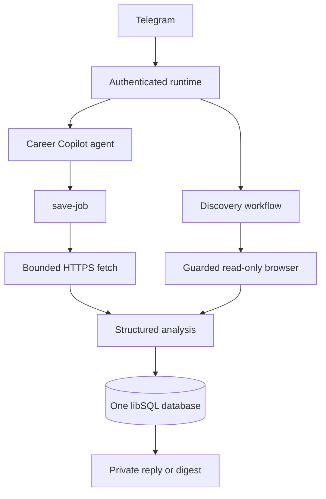

# Career Copilot

A local-first, single-owner career assistant built with Mastra. It runs through a private Telegram chat, remembers the owner's career context, saves and analyzes supported job URLs, and can discover qualifying roles through a guarded read-only browser.

```text
Telegram conversation or /save
  → authenticated runtime
  → bounded fetch or guarded browser read
  → structured fit analysis
  → durable job/report state
  → private reply or discovery digest
```

## Current scope

### Implemented

- Guided `/onboarding` with structured review, edits, cancellation, and explicit profile activation.
- Bounded text-based PDF resume ingestion during onboarding with fail-closed PII redaction. Image files, DOCX, OCR/scanned PDFs, and arbitrary files remain unsupported.
- `/save`, `/job`, `/queue`, and natural-language job saving with structured analysis and durable Markdown reports.
- `/explore_jobs [query]` for an immediate, five-site discovery pass that qualifies and saves matching roles.
- Daily `/discovery` scheduling at 12:00 PM in the owner's captured timezone, with `/discovery on`, `/discovery off`, and `/discovery status` controls.
- Guarded, read-only browser access over an externally launched authenticated Chrome session. Discovery can navigate and read authorized job sites; it cannot submit forms, type, run scripts, or mutate job sites.
- One owner, one runtime, Telegram private-chat authorization, and one libSQL database: Turso in production or a protected local file in development.
- Startup recovery for interrupted jobs and successful jobs whose notification was not delivered.
- Privacy-safe terminal events and redacted Mastra traces.

### Not implemented

- Browser-assisted applications, automatic applications, form submission, or any job-site mutation.
- CSV import, arbitrary document ingestion, OCR, image/DOCX support, or resume personalization output.
- Multiple owners, multiple runtime instances, distributed coordination, or a general worker/queue system. Discovery is a separate Mastra workflow; `/save` remains synchronous inside the conversational tool call.
- Authenticated stdio, HTTP API, or Studio ingress adapters.
- Scheduled backup, retention, export, purge, or external monitoring.

The full current architecture is in [Architecture](docs/architecture.md), and planned work is in the [Roadmap](docs/roadmap.md).

## Commands

| Command | Behavior |
|---|---|
| `/onboarding` | Start or resume guided profile onboarding. |
| `/onboarding status` | Show draft and active-profile state. |
| `/onboarding restart` | Clear the current draft and start again. |
| `/onboarding cancel` | Cancel onboarding and clear the draft. |
| `/save <url>` | Fetch, analyze, and persist one supported job URL. |
| `/job [job-id]` | Show the latest job or one job in this conversation. |
| `/queue` | List saved jobs in this conversation. |
| `/explore_jobs [query]` | Run an immediate discovery pass across the five supported sites. |
| `/discovery [status\|on\|off]` | Inspect, enable, or pause daily discovery. |
| `/reset onboarding` | Clear only this conversation's onboarding draft. |
| `/reset profile` | Clear the owner's profile and onboarding drafts; preserve jobs/reports. |
| `/reset all` | Clear CareerStore data; conversation history and task state remain preserved. |

Telegram also registers single-token aliases for nested commands, including `/onboarding_status`, `/onboarding_restart`, `/onboarding_cancel`, `/reset_onboarding`, `/reset_profile`, and `/reset_all`.

## Setup

### Prerequisites

- Node.js `>=22.13.0`
- npm
- A Telegram bot token, one private Telegram user ID, and one private chat ID
- Credentials for the selected Mastra model provider

### Install and configure

```bash
git clone <repository-url>
cd career-copilot
npm install
cp .env.example .env
```

For local development, configure a protected file-backed database in `.env`:

```dotenv
MASTRA_DATA_DIR=/home/you/.local/share/career-copilot
MASTRA_DATABASE_URL=file:/home/you/.local/share/career-copilot/career-copilot.db
CAREER_COPILOT_OWNER_RESOURCE_ID=career-owner-v0
CAREER_COPILOT_OWNER_ENABLED=true
TELEGRAM_BOT_TOKEN=replace-me
TELEGRAM_ALLOWED_USER_IDS=123456789
CAREER_COPILOT_PRIVATE_CHAT_IDS=123456789
CAREER_COPILOT_MODEL=opencode-go/deepseek-v4-flash
CAREER_COPILOT_MEMORY_MODEL=opencode-go/deepseek-v4-flash
OPENCODE_API_KEY=replace-me
```

Use the project scripts:

```bash
npm run dev
```

Studio is available at `http://localhost:4111` for redacted trace inspection. Production uses a Turso `libsql:`/`https:` URL and `TURSO_AUTH_TOKEN` instead of the local database settings. See [Operations](docs/operations.md) for complete configuration, browser setup, recovery, and troubleshooting.

### Smoke test

1. Send the bot useful career context or complete `/onboarding`.
2. Send `/save https://www.linkedin.com/jobs/view/...` or another supported job URL.
3. Confirm the reply contains the structured analysis and report ID.
4. Run `/job <job-id>` and `/queue`.
5. If Chrome is configured through `BROWSER_CDP_URL`, try `/explore_jobs` and inspect the digest.

## Architecture at a glance



See [Architecture](docs/architecture.md) for trust boundaries, persistence, recovery, discovery, and privacy details.

## Development

Run the checks used for changes:

```bash
npm test
npm exec tsc -- --noEmit
npm run build
npm run eval:test
git diff --check
```

Tests are network-free and use boundary fakes instead of paid model, Telegram, or live job-site calls. See [Contributing](docs/contributing.md) and the [evaluation harness guide](docs/eval-harness-guide.md).

## Repository layout

```text
src/mastra/index.ts                 composition root and Mastra registrations
src/agents/agent.ts                 career agent, tools, memory, and analysis
src/services/career-runtime.ts      Telegram routing, onboarding, and recovery
src/discovery/                      scheduled and on-demand job discovery
src/browser/                        guarded read-only CDP browser
src/storage/career-store.ts         libSQL jobs, reports, profiles, and discovery state
src/tools/                          trusted context, URL policy, fetch, and save pipeline
docs/                               architecture, operations, contribution, and roadmap guides
docs/specs/                         onboarding/PII and evaluation seam specifications
eval/                               deterministic contract and quality harness
test/                               unit and integration regression tests
```

## Documentation

- [Documentation index](docs/README.md)
- [Architecture](docs/architecture.md)
- [Operations and troubleshooting](docs/operations.md)
- [Contributing](docs/contributing.md)
- [Roadmap](docs/roadmap.md)
- [Onboarding and PII specification](docs/specs/onboarding-pii-redaction.md)
- [Evaluation harness guide](docs/eval-harness-guide.md)
- [Evaluation harness seams](docs/specs/eval-harness-seams.md)

## Roadmap

See the [roadmap](docs/roadmap.md). Items there are future work; the current-scope list above describes shipped behavior.
