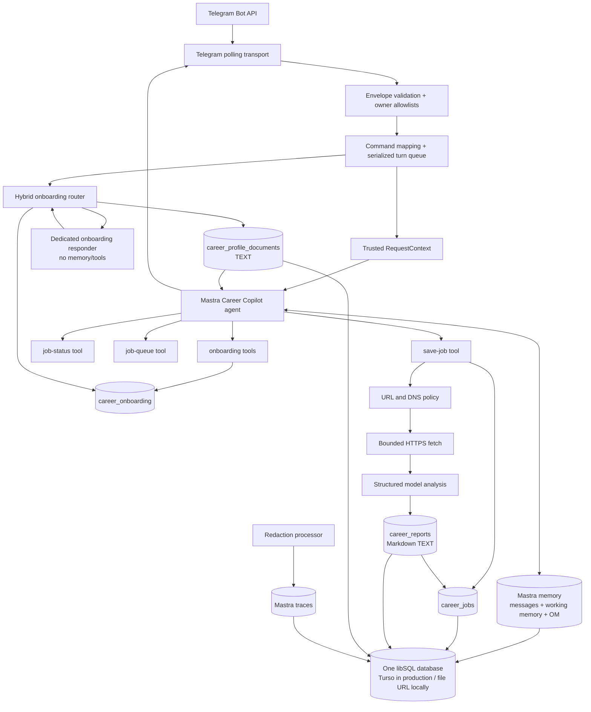

# Career Copilot

A local-first, single-owner career assistant built with Mastra. One conversational agent remembers the owner's career context and can save a supported job URL end to end:

```text
conversation or /save
  → trusted ingress context
  → bounded job fetch
  → structured fit analysis
  → private Markdown report row
  → durable completion notification
```

This README describes the architecture that exists in this repository. It is both the setup guide and the starting context for contributors and coding agents.

## Current scope

Implemented:

- one owner and one registered Mastra agent;
- Telegram private-chat ingress with explicit user and chat allowlists;
- natural-language career conversation plus `/save`, `/job`, `/queue`, and guided `/onboarding` shortcuts;
- resource-scoped working memory, the last 20 conversation messages, and thread-scoped Observational Memory outside active onboarding;
- owner/conversation-scoped guided onboarding state with structured review, edit, cancel, and confirmed profile activation;
- one libSQL backend: Turso in production, file-backed locally;
- synchronous save execution with durable job state;
- HTTPS-only acquisition from an explicit job-site allowlist;
- SSRF, redirect, content-type, timeout, and response-size controls;
- structured model analysis;
- owner-scoped Markdown report rows with stable report IDs;
- startup recovery and retry of unsent successful notifications;
- redacted Mastra traces and safe lifecycle events.

Not implemented:

- resume file/upload, PDF, image, DOCX, URL, or arbitrary file ingestion during onboarding until `mastra-pii` is benchmarked and integrated; plain structured career text is accepted;
- job discovery, scheduling, CSV import, or browser-assisted applications;
- automatic applications or mutation of job sites;
- multiple owners, multiple runtime instances, or distributed coordination;
- a background worker or Mastra workflow separate from the conversational turn;
- authenticated stdio, HTTP API, or Studio ingress adapters;
- automatic backup, retention, export, purge, or external monitoring.

The save pipeline currently runs inside the agent tool call. `career_jobs` makes a started save recoverable, but this is not a distributed queue.

## Runtime architecture



### Composition root and startup

`src/mastra/index.ts` is the composition root. Importing it performs the following work:

1. `resolveRuntimeConfig()` validates one libSQL database URL: local `file:` for development/tests, or Turso `libsql:`/`https:` with `TURSO_AUTH_TOKEN` for production.
2. `CareerStore` opens the same libSQL database and initializes/migrates `career_jobs`, `career_reports`, `career_profile_documents`, and `career_onboarding`.
3. Active owner-scoped profile documents are available from `career_profile_documents`, joined, and capped at 100,000 characters.
4. `createCareerAgentKit()` creates the agent and its career/onboarding tools with the configured memory model.
5. Mastra is created with the agent, the same LibSQL/Turso storage, and redacted observability.
6. The Career Copilot runtime and Telegram long-polling transport are created.
7. Unfinished jobs are recovered before Telegram polling begins.

`src/index.ts` only re-exports this composition root. All agents, tools, workflows, and scorers must be registered from `src/mastra/index.ts`. The current application registers one agent, no workflows, and no scorers. Tools are attached to the agent rather than separately exposed as trusted public endpoints.

When `TELEGRAM_BOT_TOKEN` is empty, recovery still runs without notification and polling does not start. When `NODE_ENV=production`, deployment configuration is required and validated eagerly.

### One agent and guarded tools

`src/agents/agent.ts` creates the `careerCopilot` agent.

The agent uses:

- model: `CAREER_COPILOT_MODEL`, defaulting to `opencode-go/deepseek-v4-flash`;
- message history: the last 20 messages;
- working memory: resource-scoped Career Profile fields;
- Observational Memory: thread-scoped, using `CAREER_COPILOT_MEMORY_MODEL` or the main model fallback;
- generation limit: eight steps for a conversation turn;
- structured analysis: one model step, no tool calls, validated by `AnalysisSchema`.

Registered tools:

| Tool | Purpose | Authorization scope |
|---|---|---|
| `save-job` | Fetch, analyze, report, and track one job | Trusted owner, actor, conversation, and request context |
| `job-status` | Return safe state for one job or the latest job | Owner plus current conversation |
| `job-queue` | Return up to 100 job IDs and statuses | Owner plus current conversation |

Active onboarding uses a dedicated tool-free responder with owner/conversation-scoped Mastra memory. The runtime validates draft patches and owns review, edits, cancellation, and confirmation; only exact runtime-observed `confirm` activates the profile.

Outside onboarding, the agent is instructed to ask one concise question when profile context is insufficient, store the pending URL in working memory, and continue after the owner replies; another `/save` should not be required.

The same agent performs the final structured job analysis through `analyzeJob()`. The analysis call disables tools, accepts at most 100,000 characters each of job text and profile context, and must produce schema-valid title, company, location, summary, fit score, and next step.

### Channel-independent trusted context

Career tools do not depend on Telegram identifiers. They require a server-created Mastra `RequestContext` with:

| Field | Meaning |
|---|---|
| `ownerId` | Stable resource owner whose memory and jobs are being accessed |
| `actorId` | Authenticated caller identity supplied by the ingress adapter |
| `conversationId` | Authorized conversation boundary used for memory and job visibility |
| `requestId` | Stable ingress event ID used for job deduplication |
| `resumeJobId` | Optional persisted job selected by trusted recovery code |
| `capability` | Process-local object identity that callers cannot serialize or forge |

`createCareerToolContext()` is the only current issuer of this capability. The Telegram adapter maps `userId → actorId`, `chatId → conversationId`, and `update_id → requestId` after validating the update and allowlists.

A future stdio or API adapter must do the same work at its trust boundary:

1. authenticate the caller;
2. authorize the owner and conversation;
3. derive a stable request ID;
4. call `createCareerToolContext()` server-side;
5. invoke the agent with owner-scoped memory and that context.

Never accept these fields or the capability from an untrusted client payload. Mastra Studio does not currently implement this authenticated ingress contract. It is useful for trace inspection, but direct Studio tool calls are intentionally denied.

### Telegram ingress

`src/channels/telegram-transport.ts` long-polls `getUpdates` and sends replies through `sendMessage`.

Transport behavior:

- requests time out after 15 seconds;
- long polls use Telegram's 25-second timeout and a 30-second local abort;
- only `message` updates are requested;
- replies are split at Telegram's 4,096-character limit;
- the offset advances only after an update is handled;
- polling failures emit a safe event and retry after one second;
- `stop()` aborts an active long poll without logging an intentional abort as a poll failure.

`src/channels/telegram-auth.ts` validates complete raw envelopes before the runtime reads them. `src/services/career-runtime.ts` then rejects:

- malformed envelopes;
- non-private chats;
- users or chats outside the configured allowlists;
- bot, edited, forwarded, channel, and non-text messages;
- duplicate `update_id` values seen by the current process.

Accepted turns execute serially through one promise queue. This prevents concurrent turns from racing the single owner's conversation state. Once an update's state/tool effects have completed, the runtime caches the outbound response before calling Telegram; if that reply fails and Telegram retries the same update in the same process, the cached response is resent without rerunning model/state/tool effects. This in-memory cache is intentionally not durable across process restarts; persisted job deduplication still protects save requests, but onboarding reply retries after a restart may need normal state recovery/resume.

Command shortcuts are translated into explicit agent instructions; they do not bypass the agent:

```text
/save <url>      save a supported job after profile context is sufficient
/job             show the latest job in this conversation
/job <job-id>    show one job in this conversation
/queue           list jobs in this conversation
/onboarding      start or resume guided structured onboarding
/onboarding restart  clear any prior draft and start over
/onboarding cancel   cancel active onboarding and clear draft content
```

Active onboarding text is routed to the hybrid onboarding flow instead of normal `/save`, `/job`, `/queue`, or tool calls. The responder uses owner/conversation-scoped Mastra message history, working memory, and observational memory, but receives no trusted tool request context. A narrow deterministic trust-boundary guard rejects obvious direct identifiers such as email, phone, legal-name phrases, exact birth-date phrases, government/financial IDs, and credential values before model calls or draft persistence; it is not a general redactor. Natural-language requests such as “save this job” use the normal agent and tools only outside onboarding.

### Save pipeline

`src/tools/save-job-tool.ts` executes the current save pipeline in order:

1. Validate the trusted `JobInput`.
2. Combine active Turso profile documents and conversational profile context; reject an empty profile.
3. Insert or recover a job by unique `requestId`/`transport_event_id`.
4. Verify that the persisted owner, actor, conversation, and URLs still match the request.
5. Return the existing result if the same request already succeeded.
6. Mark the job `running` and increment its attempt count.
7. Fetch the canonical job URL.
8. Ask the agent for schema-constrained analysis with tools disabled.
9. Store the Markdown report as a `career_reports` text row.
10. Persist the safe result as `succeeded` with the report ID.
11. Reply to Telegram, then set `notified_at`.

Fetch and model-analysis operations retry transient network, timeout, HTTP 408, HTTP 429, and HTTP 5xx failures up to three immediate attempts. A caught pipeline failure becomes terminal `failed` immediately; it is not automatically retried. A second durable processing attempt occurs only when interruption leaves a job `queued` or `running` for startup recovery. After two processing entries, the owner must send a new save request.

A job is never marked successful before the report row exists.

A failure is reduced to a safe user-facing category before persistence. Raw fetched pages, profile text, credentials, and internal exception details are not stored in `career_jobs`.

### URL acquisition boundary

Supported site families are defined in `src/tools/job-url.ts`:

- `linkedin.com`
- `foundit.in`
- `cutshort.io`
- `naukri.com`
- `indeed.com`

Subdomains are accepted. URLs must use HTTPS and may not contain credentials, a non-default port, or a fragment.

`src/tools/web-fetch-tool.ts` adds network controls:

- DNS is resolved before connection;
- any private, loopback, link-local, reserved, documentation, multicast, or otherwise invalid resolved address rejects the request;
- production requests connect to the validated IP while preserving TLS SNI and the HTTP Host header;
- redirects are manual, limited to three, fully revalidated, and must remain in the original supported site family;
- accepted content types are `text/html`, `application/xhtml+xml`, and `text/plain`;
- content encoding is requested as `identity`;
- timeout defaults to 15 seconds;
- response bodies are limited to 1,000,000 bytes;
- model input is truncated to 100,000 characters.

Fetched content is untrusted data. The agent instructions explicitly prohibit following instructions found inside it.

### Profile and report text storage

Production profile and report persistence lives in the configured libSQL/Turso database, not the local filesystem.

Tables:

| Table | Purpose |
|---|---|
| `career_profile_documents` | Owner-scoped active profile documents, stored as text with name, version, SHA-256, byte size, and timestamps |
| `career_onboarding` | Owner/conversation-scoped structured onboarding draft, status, and optimistic version; no raw resume/file columns |
| `career_reports` | Markdown reports, stored as text with owner ID, job ID, version, SHA-256, byte size, and timestamp |

Profile document rules:

- owner-scoped reads use active documents only;
- secret-looking document names are rejected;
- secret-looking content is rejected before it can reach prompts;
- joined profile text is capped at 100,000 characters.

Report rules:

- jobs reference stable report IDs;
- report content is stored before a job can be marked `succeeded`;
- report rows retain a SHA-256 hash and byte size for integrity checks.

`src/integrations/local-files.ts` remains only for legacy tests and safe one-time import helpers. Do not add a second production report/profile write path.

### Persistence and recovery

One libSQL database owns durable backend state.

| Environment | Database URL | Contents |
|---|---|---|
| Development/test | absolute local `file:` URL inside `MASTRA_DATA_DIR` | Mastra memory/traces, jobs, reports, profile documents |
| Production | Turso `libsql:`/`https:` URL plus `TURSO_AUTH_TOKEN` | Mastra memory/traces, jobs, reports, profile documents |

`MASTRA_DATABASE_URL` configures the shared store. Local file URLs must stay inside the protected data directory and cannot use `TURSO_AUTH_TOKEN`. Remote URLs require `TURSO_AUTH_TOKEN`, must be Turso `*.turso.io` hosts, and may not embed credentials, query strings, or fragments.

`career_jobs` stores:

- immutable job, owner, actor, conversation, request, and URL identity;
- status: `queued`, `running`, `succeeded`, or `failed`;
- run correlation and attempt count;
- report ID;
- safe result or safe error;
- notification timestamp;
- creation and update timestamps.

`transport_event_id` is unique, so replaying one accepted ingress request cannot create another job. The in-memory Telegram replay set is only a same-process optimization; the database constraint is the durable save deduplication boundary.

At startup, recovery is serialized and runs before Telegram polling:

- `queued` and `running` jobs are resumed only if the owner is enabled and their persisted actor and conversation remain allowlisted;
- recovery reuses persisted identity and URL values;
- successful jobs with no `notified_at` value are delivered once more;
- notification is marked only after Telegram send succeeds;
- failed notification never rolls back completed work.

The database schema is created fresh and is authoritative; there is no migration path from older local databases. The legacy tracker and local-file import surface was removed. Before the first run against a new version, delete the old development databases (`.local-data/mastra.db`, `.local-data/career.db`) — opening an old DB breaks because its columns no longer match the schema. The old `.local-data/reports/*.md` files are obsolete and can be deleted by the owner.

### Observability, terminal logs, and privacy

Run `npm run dev` and watch the terminal for one-line JSON app events. The app creates one shared privacy-safe terminal logger in `src/mastra/index.ts` and injects it through Telegram transport, runtime, agent/tools, and the save pipeline. It does not depend on Mastra's default logger and does not log empty Telegram polls.

Safe fields are allowlisted: event name, phase/status/version/attempt/duration, update/request ID, generated job/report IDs, command/tool name, field keys, and error class. Logs exclude owner/user/chat IDs, message text, URLs, draft/profile values, fetched content, analysis/report content, credentials/tokens, and raw error messages/stacks.

Events cover startup, Telegram, commands, agent/tools, jobs, recovery, notifications, and onboarding. See the [onboarding and logging specification](docs/specs/onboarding-pii-redaction.md#terminal-app-logs) for the required catalog.

Troubleshooting tips:

- No terminal events: confirm `npm run dev` reaches `runtime.ready`; synchronous config/database/profile failures can stop module initialization before app logging starts.
- Telegram is silent: look for `telegram.poll.started` and then non-empty `telegram.update.received`; empty polls are intentionally not logged.
- A job stalls: follow one `jobId` through `job.phase.*`; a failed phase logs only `errorName`, never raw provider or fetch details.
- User-visible operational state remains `/job` and `/queue`; terminal events are diagnostics, not an audit log.

Mastra traces are still stored in the configured libSQL database. Before export, `redactTracePayloads` removes every span input and output and replaces error details with the error name plus `Operation failed.` Logging inside the observability configuration is disabled.

Open Studio at `http://localhost:4111` during `npm run dev`, then use **Observability → Traces**. Use generated job IDs to correlate safe terminal events.

## Setup

### Prerequisites

- Node.js `>=22.13.0`;
- npm;
- a Telegram bot token from BotFather;
- one private Telegram user ID and chat ID;
- credentials for the configured model provider.

This repository uses `package-lock.json`. Do not add another package-manager lockfile.

### 1. Install

```bash
git clone <repository-url>
cd mastra-demo
npm install
cp .env.example .env
```

Use the scripts in `package.json`; do not invoke `mastra dev` or `mastra build` directly.

### 2. Choose the backend database

For local development, use one protected local libSQL file:

```bash
mkdir -p "$HOME/.local/share/career-copilot"
chmod 700 "$HOME/.local/share/career-copilot"
```

For production, create a Turso database and token instead:

```bash
turso db create career-copilot
turso db show --url career-copilot
turso db tokens create career-copilot
```

Store Turso credentials only in deployment configuration, never in source. This architecture does not require R2, Supabase, or another payment-method-backed object store.

### 3. Configure `.env`

Local development:

```dotenv
MASTRA_DATA_DIR=/home/you/.local/share/career-copilot
MASTRA_DATABASE_URL=file:/home/you/.local/share/career-copilot/career-copilot.db
# TURSO_AUTH_TOKEN must be empty for local file URLs

CAREER_COPILOT_OWNER_RESOURCE_ID=career-owner-v0
CAREER_COPILOT_OWNER_ENABLED=true

TELEGRAM_BOT_TOKEN=123456:replace-me
TELEGRAM_ALLOWED_USER_IDS=123456789
CAREER_COPILOT_PRIVATE_CHAT_IDS=123456789

CAREER_COPILOT_MODEL=opencode-go/deepseek-v4-flash
CAREER_COPILOT_MEMORY_MODEL=opencode-go/deepseek-v4-flash
OPENCODE_API_KEY=replace-me
# GOOGLE_GENERATIVE_AI_API_KEY=replace-me
```

Production Turso replaces only the database settings:

```dotenv
MASTRA_DATABASE_URL=libsql://your-db-your-org.turso.io
TURSO_AUTH_TOKEN=replace-me
```

Configuration notes:

- `MASTRA_DATABASE_URL` accepts an absolute local `file:` URL inside `MASTRA_DATA_DIR`, or a remote Turso `libsql:`/`https:` URL.
- Remote URLs require `TURSO_AUTH_TOKEN`; local file URLs reject it.
- Database URLs may not contain credentials, query strings, or fragments.
- `CAREER_COPILOT_OWNER_RESOURCE_ID` is the stable Mastra memory resource ID. Changing it creates a different memory owner.
- `CAREER_COPILOT_MEMORY_MODEL` controls Observational Memory's Observer/Reflector model and falls back to `CAREER_COPILOT_MODEL`.
- `CAREER_COPILOT_OWNER_ENABLED=false` disables Telegram authorization and recovery delivery.
- Telegram ID lists accept comma-separated numeric IDs in development. Production currently requires exactly one user ID and one private chat ID.
- Set the credential variable required by the selected Mastra model provider.
- `.env`, `.local-data/`, `.mastra/`, and generated outputs must remain untracked.

### 4. Run
### 5. Run

Development:

```bash
npm run dev
```

Studio is available at:

```text
http://localhost:4111
```

Production build and start:

```bash
npm run build
NODE_ENV=production npm start
```

`npm run build` creates disposable `.mastra/` output. It is not source data and must not be committed.

### 6. Smoke test

1. Send the bot a private message containing useful profile context.
2. Send `/save https://www.linkedin.com/jobs/view/...` or a supported-site URL.
3. Answer one follow-up question if the agent needs more profile context.
4. Confirm the Telegram reply includes the analysis summary.
5. Confirm the report row exists in `career_reports` for that report ID.
6. Run `/job <job-id>` and `/queue`.
7. Inspect redacted traces in Studio.

## Development and contribution

### Required checks

Run all checks before claiming a change is complete:

```bash
npm test
npm exec tsc -- --noEmit
npm run build
git diff --check
```

Tests use Node's built-in test runner and TypeScript type stripping. They must not call a paid model, Telegram, or live Google APIs; inject boundary fakes instead.

### Change the correct boundary

| Change | Primary location |
|---|---|
| Mastra registration or concrete dependency wiring | `src/mastra/index.ts` |
| Agent behavior, memory, tools, or analysis schema use | `src/agents/agent.ts` |
| Telegram envelope authorization | `src/channels/telegram-auth.ts` |
| Telegram polling and delivery | `src/channels/telegram-transport.ts` |
| Command mapping, serialized turns, recovery | `src/services/career-runtime.ts` |
| Trusted tool context contract | `src/tools/career-context.ts` |
| Save orchestration and retry boundaries | `src/tools/save-job-tool.ts` |
| Supported hosts and URL syntax | `src/tools/job-url.ts` |
| DNS, SSRF, redirects, and response limits | `src/tools/web-fetch-tool.ts` |
| Job persistence and state transitions | `src/storage/career-store.ts` |
| Profile/report filesystem policy | `src/integrations/local-files.ts` |
| Runtime environment validation | `src/config/runtime.ts` |
| Shared libSQL job/report/profile storage | `src/storage/career-store.ts` |
| Trace redaction/export | `src/observability.ts` |
| Shared persisted schemas and safe errors | `src/contracts/v0.ts` |
| Acceptance and regression coverage | `test/minimal-v0.test.ts` |

Keep changes within these boundaries. Do not add a generic repository layer, queue framework, workflow abstraction, or second implementation “for later.”

### Security invariants

A contribution must preserve all of the following unless the architecture is intentionally revised and tested:

1. Authorization occurs before agent execution.
2. Tool identity context is issued server-side and is not client-forgeable.
3. Memory is scoped to the configured owner and conversation thread.
4. Job reads are scoped to owner plus conversation.
5. Persisted recovery identity is reauthorized against current configuration.
6. URLs and every redirect remain HTTPS and on the supported-site boundary.
7. DNS targets are public and connections remain pinned to validated addresses.
8. Untrusted fetched content never becomes instructions.
9. Profile, reports, databases, and traces remain local and private by default.
10. Completion is persisted before notification; notification failure cannot erase work.
11. Logs, traces, persisted errors, and user replies contain no secrets or raw fetched content.

Adding a new ingress is primarily an authentication and authorization change, not a transport-only change. Adding a supported site is a security-policy change and requires redirect/DNS tests. Changing persistence requires migration and recovery tests against an existing database.

### Mastra API discipline

Mastra APIs change quickly. Before modifying Mastra code:

1. inspect the exact installed package versions in `package.json`;
2. read embedded docs under `node_modules/@mastra/*/dist/docs/`;
3. inspect installed type declarations or source when docs are incomplete;
4. use remote Mastra documentation only after installed evidence;
5. run typecheck, tests, and the project `build` script.

Do not rely on remembered Mastra APIs and do not run bare `mastra dev` or `mastra build` commands.

### Coding-agent pickup checklist

A coding agent starting work here should:

1. read `AGENTS.md` and load the project `mastra` skill;
2. read this README, then inspect the exact files listed for the requested boundary;
3. use the code-review graph before broad file search;
4. check `git status` and preserve unrelated work;
5. distinguish current code from aspirational plans or ADRs;
6. verify installed Mastra APIs before edits;
7. make the smallest boundary-correct change;
8. add one focused regression check for non-trivial logic;
9. run the full required checks;
10. update this README when architecture, setup, trust boundaries, or operational behavior changes.

## Repository layout

```text
.env.example                    documented runtime configuration
src/index.ts                    package entrypoint; re-exports Mastra composition
src/mastra/index.ts             composition root and all Mastra registration
src/agents/agent.ts             one memory-enabled conversational agent and tools
src/channels/telegram-auth.ts   raw envelope validation and authorization primitives
src/channels/telegram-transport.ts Telegram long polling and message delivery
src/config/runtime.ts           environment, path, and deployment validation
src/contracts/v0.ts             persisted job, analysis, and safe-result schemas
src/integrations/local-files.ts legacy safe-file helpers (tests only)
src/services/career-runtime.ts  command mapping, turn serialization, and recovery
src/storage/career-store.ts     shared libSQL jobs, reports, and profile documents
src/tools/career-context.ts     trusted channel-independent tool capability
src/tools/job-url.ts            supported-site and URL policy
src/tools/save-job-tool.ts      durable save pipeline
src/tools/web-fetch-tool.ts     bounded DNS-pinned HTTPS acquisition
src/observability.ts            local trace export and payload redaction
test/minimal-v0.test.ts         compact acceptance and regression suite
```

## Operational troubleshooting

| Symptom | Check |
|---|---|
| Bot does not respond | `telegram.poll.started`, `telegram.poll.failed`, token, user allowlist, and private-chat allowlist |
| Update is rejected | `telegram.update.handled` reason; edited, forwarded, bot, channel, malformed, replayed, and non-private messages are rejected |
| Agent asks for context | Add career facts conversationally or import safe text into `career_profile_documents`; production no longer reads a profile directory |
| Studio tool call fails authorization | Expected: Studio is not an authenticated Career Copilot ingress |
| URL is rejected | HTTPS, supported host family, no credentials/port/fragment, public DNS, and same-site redirects |
| Fetch fails | Content type, 15-second timeout, 1 MB limit, redirects, DNS policy, or remote HTTP status |
| Telegram notification fails after success | `/job` remains authoritative; restart retries successful rows without `notified_at` |
| Startup fails in production | All production-required owner and Telegram values must be present |
| Database path is rejected | Development/test: use an absolute `file:` URL inside `MASTRA_DATA_DIR`; production: use a Turso `libsql:`/`https:` host plus `TURSO_AUTH_TOKEN` |

For recovery-sensitive problems, inspect the libSQL database only from a backup or while the process is stopped. Do not edit rows manually; persisted identity and state checks intentionally fail closed.

## Roadmap

These are planned changes, not current behavior. Each item requires a written contract and regression coverage before implementation.

### P-1 — Turso Cloud persistence

- [x] **Move backend persistence to a single Turso/libSQL database.** Production stores Mastra memory/traces, `career_jobs`, Markdown reports, and profile documents in Turso with local file-backed libSQL retained for development/tests. Remaining operational work is live cutover, scheduled exports, and any future binary artifact store if text rows stop being enough.

### P0 — Resume privacy boundary

- [x] **Add guided `/onboarding` ([spec](docs/specs/onboarding-pii-redaction.md), [#10](https://github.com/KripaMishra/career-copilot/issues/10)).** Collects structured career context one question at a time with owner/conversation-scoped Mastra memory, requires owner review and runtime-observed explicit confirmation, then activates the versioned profile. Resume file/upload ingestion remains intentionally unavailable in this first phase; plain structured career text is accepted.
- [ ] **Integrate the separately published layered Mastra PII processor for resume ingestion ([package](https://github.com/KripaMishra/mastra-pii), [package issue #1](https://github.com/KripaMishra/mastra-pii/issues/1)).** After OpenRedaction deterministic checks and local Transformers.js NER are benchmarked, consume a reviewed prerelease and enable bounded text/PDF resume ingestion before the ordinary agent path; Mastra `PIIDetector` remains defense-in-depth.

### P1 — Conversation and memory

- [ ] **Debounce rapid messages without reordering them.** Add a short, configurable per-conversation collection window that combines burst messages into one agent turn while preserving arrival order, request identity, authorization, replay protection, and serialized execution. Commands and recovery turns need an explicit flush/bypass rule.
- [ ] **Expose useful agent activity.** Map runtime phases to channel-neutral states such as `typing`, `thinking`, `reading`, `navigating`, `writing`, and `waiting`. Telegram should translate supported states to `sendChatAction` and concise status messages, rate-limit updates, clear stale state on success/failure, and never expose chain-of-thought, URLs, resume content, or internal errors.
- [ ] **Specify multi-layer memory.** Keep bounded per-conversation session history separate from an owner-scoped compiled career context. The initial compiled context may remain unstructured, but its specification must define capture, consolidation, provenance, conflict correction, recall, retention, export, purge, and model-write rules for resume content, experience, skills, preferences, strengths, weaknesses, constraints, likes, and dislikes.

### P1 — Acquisition and artifacts

- [ ] **Add resilient, policy-compliant acquisition fallbacks.** Evaluate self-hosted SearXNG and Firecrawl when direct fetch is blocked or incomplete. Do not implement bot-detection evasion. The design must preserve the supported-site policy, authorization, SSRF and redirect controls, content limits, source attribution, provider terms, privacy guarantees, deterministic fallback order, and auditable failure reasons.
- [ ] **Make report recall user-facing.** Reports now have stable database IDs; add an owner-authorized tool to retrieve a report summary or full Markdown without exposing arbitrary database rows.
