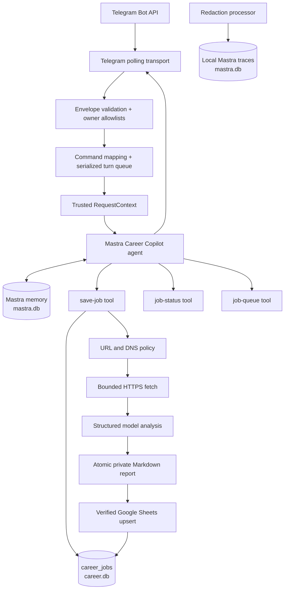

# Career Copilot

A local-first, single-owner career assistant built with Mastra. One conversational agent remembers the owner's career context and can save a supported job URL end to end:

```text
conversation or /save
  → trusted ingress context
  → bounded job fetch
  → structured fit analysis
  → private Markdown report
  → verified Google Sheets row
  → durable completion notification
```

This README describes the architecture that exists in this repository. It is both the setup guide and the starting context for contributors and coding agents.

## Current scope

Implemented:

- one owner and one registered Mastra agent;
- Telegram private-chat ingress with explicit user and chat allowlists;
- natural-language career conversation plus `/save`, `/job`, and `/queue` shortcuts;
- resource-scoped working memory and the last 20 conversation messages;
- synchronous save execution with durable job state;
- HTTPS-only acquisition from an explicit job-site allowlist;
- SSRF, redirect, content-type, timeout, and response-size controls;
- structured model analysis;
- owner-only atomic Markdown reports;
- idempotent, read-after-write-verified Google Sheets updates;
- startup recovery and retry of unsent successful notifications;
- redacted local Mastra traces and safe lifecycle events.

Not implemented:

- job discovery, scheduling, CSV import, or browser-assisted applications;
- automatic applications or mutation of job sites;
- multiple owners, multiple runtime instances, or distributed coordination;
- a background worker or Mastra workflow separate from the conversational turn;
- authenticated stdio, HTTP API, or Studio ingress adapters;
- automatic backup, retention, export, purge, or external monitoring.

The save pipeline currently runs inside the agent tool call. `career_jobs` makes a started save recoverable, but this is not a distributed queue.

## Runtime architecture



### Composition root and startup

`src/mastra/index.ts` is the composition root. Importing it performs the following work:

1. `resolveRuntimeConfig()` validates configuration and creates protected local directories.
2. `CareerStore` opens `${MASTRA_DATA_DIR}/career.db` and creates or minimally migrates `career_jobs`.
3. The Google OAuth and Sheets boundaries are constructed.
4. Profile `.md` and `.txt` files are loaded, joined, and capped at 100,000 characters.
5. `createCareerAgentKit()` creates the agent and its three tools.
6. Mastra is created with the agent, LibSQL storage, and local observability.
7. The Career Copilot runtime and Telegram long-polling transport are created.
8. Unfinished jobs are recovered before Telegram polling begins.

`src/index.ts` only re-exports this composition root. All agents, tools, workflows, and scorers must be registered from `src/mastra/index.ts`. The current application registers one agent, no workflows, and no scorers. Tools are attached to the agent rather than separately exposed as trusted public endpoints.

When `TELEGRAM_BOT_TOKEN` is empty, recovery still runs without notification and polling does not start. When `NODE_ENV=production`, deployment configuration is required and validated eagerly.

### One agent, three tools

`src/agents/agent.ts` creates the `careerCopilot` agent.

The agent uses:

- model: `CAREER_COPILOT_MODEL`, defaulting to `opencode-go/deepseek-v4-flash`;
- message history: the last 20 messages;
- working memory: resource-scoped Career Profile fields;
- generation limit: eight steps for a conversation turn;
- structured analysis: one model step, no tool calls, validated by `AnalysisSchema`.

Registered tools:

| Tool | Purpose | Authorization scope |
|---|---|---|
| `save-job` | Fetch, analyze, report, and track one job | Trusted owner, actor, conversation, and request context |
| `job-status` | Return safe state for one job or the latest job | Owner plus current conversation |
| `job-queue` | Return up to 100 job IDs and statuses | Owner plus current conversation |

The agent is instructed to ask one concise question when profile context is insufficient, store the pending URL in working memory, and continue after the owner replies; another `/save` should not be required. This is model-directed conversational behavior, not a deterministic state machine.

The same agent performs the final structured job analysis through `analyzeJob()`. The analysis call disables tools, accepts at most 100,000 characters each of job text and profile context, and must produce schema-valid title, company, location, summary, fit score, and next step.

### Channel-independent trusted context

Career tools do not depend on Telegram identifiers. They require a server-created Mastra `RequestContext` with:

| Field | Meaning |
|---|---|
| `ownerId` | Stable resource owner whose memory and jobs are being accessed |
| `actorId` | Authenticated caller identity supplied by the ingress adapter |
| `conversationId` | Authorized conversation boundary used for memory and job visibility |
| `requestId` | Stable ingress event ID used for job deduplication |
| `resumeJobId` | Optional persisted job selected by trusted recovery code |
| `capability` | Process-local object identity that callers cannot serialize or forge |

`createCareerToolContext()` is the only current issuer of this capability. The Telegram adapter maps `userId → actorId`, `chatId → conversationId`, and `update_id → requestId` after validating the update and allowlists.

A future stdio or API adapter must do the same work at its trust boundary:

1. authenticate the caller;
2. authorize the owner and conversation;
3. derive a stable request ID;
4. call `createCareerToolContext()` server-side;
5. invoke the agent with owner-scoped memory and that context.

Never accept these fields or the capability from an untrusted client payload. Mastra Studio does not currently implement this authenticated ingress contract. It is useful for trace inspection, but direct Studio tool calls are intentionally denied.

### Telegram ingress

`src/channels/telegram-transport.ts` long-polls `getUpdates` and sends replies through `sendMessage`.

Transport behavior:

- requests time out after 15 seconds;
- long polls use Telegram's 25-second timeout and a 30-second local abort;
- only `message` updates are requested;
- replies are split at Telegram's 4,096-character limit;
- the offset advances only after an update is handled;
- polling failures emit a safe event and retry after one second;
- `stop()` aborts an active long poll.

`src/channels/telegram-auth.ts` validates complete raw envelopes before the runtime reads them. `src/services/career-runtime.ts` then rejects:

- malformed envelopes;
- non-private chats;
- users or chats outside the configured allowlists;
- bot, edited, forwarded, channel, and non-text messages;
- duplicate `update_id` values seen by the current process.

Accepted turns execute serially through one promise queue. This prevents concurrent turns from racing the single owner's conversation state.

Command shortcuts are translated into explicit agent instructions; they do not bypass the agent:

```text
/save <url>      save a supported job after profile context is sufficient
/job             show the latest job in this conversation
/job <job-id>    show one job in this conversation
/queue           list jobs in this conversation
```

Natural-language requests such as “save this job” use the same agent and tools.

### Save pipeline

`src/tools/save-job-tool.ts` executes the current save pipeline in order:

1. Validate the trusted `JobInput`.
2. Combine startup profile files and conversational profile context; reject an empty profile.
3. Insert or recover a job by unique `requestId`/`transport_event_id`.
4. Verify that the persisted owner, actor, conversation, and URLs still match the request.
5. Return the existing result if the same request already succeeded.
6. Mark the job `running` and increment its attempt count.
7. Fetch the canonical job URL.
8. Ask the agent for schema-constrained analysis with tools disabled.
9. Write the Markdown report atomically.
10. Upsert the tracker row and read it back.
11. Persist the safe result as `succeeded`.
12. Reply to Telegram, then set `notified_at`.

Fetch and model-analysis operations retry transient network, timeout, HTTP 408, HTTP 429, and HTTP 5xx failures up to three immediate attempts. A caught pipeline failure becomes terminal `failed` immediately; it is not automatically retried. A second durable processing attempt occurs only when interruption leaves a job `queued` or `running` for startup recovery. After two processing entries, the owner must send a new save request.

Recovery may rewrite the same atomic report path if interruption occurred after report publication but before completion was persisted. Sheet writes are safer: upsert plus read-back reconciliation prevents blind duplicate rows.

A failure is reduced to a safe user-facing category before persistence. Raw fetched pages, profile text, credentials, and internal exception details are not stored in `career_jobs`.

### URL acquisition boundary

Supported site families are defined in `src/tools/job-url.ts`:

- `linkedin.com`
- `foundit.in`
- `cutshort.io`
- `naukri.com`
- `indeed.com`

Subdomains are accepted. URLs must use HTTPS and may not contain credentials, a non-default port, or a fragment.

`src/tools/web-fetch-tool.ts` adds network controls:

- DNS is resolved before connection;
- any private, loopback, link-local, reserved, documentation, multicast, or otherwise invalid resolved address rejects the request;
- production requests connect to the validated IP while preserving TLS SNI and the HTTP Host header;
- redirects are manual, limited to three, fully revalidated, and must remain in the original supported site family;
- accepted content types are `text/html`, `application/xhtml+xml`, and `text/plain`;
- content encoding is requested as `identity`;
- timeout defaults to 15 seconds;
- response bodies are limited to 1,000,000 bytes;
- model input is truncated to 100,000 characters.

Fetched content is untrusted data. The agent instructions explicitly prohibit following instructions found inside it.

### Local files

`src/integrations/local-files.ts` owns profile and report filesystem access.

Profile rules:

- the profile, reports, and reserved topics roots must not overlap;
- profile and report roots are created with mode `0700` when first used and may not be symlinks;
- profile directories and files may not be symlinks;
- hidden files are rejected;
- only `.md` and `.txt` files are accepted;
- secret-looking filenames and secret-looking content are rejected;
- each profile file is read up to 100,000 bytes;
- accepted files are forced to mode `0600`.

Report rules:

- filenames derive from sanitized job IDs;
- reports are written to a private temporary file with mode `0600`;
- rename provides atomic publication;
- the returned metadata includes a SHA-256 content hash.

Do not place credentials, tokens, private keys, or passwords in profile files.

### Google Sheets boundary

A save is successful only after the tracker row is verified by read-back.

The tracker tab must have one header row with no duplicate column names and containing each required header exactly once:

```text
Job ID | Status | Title | Company | Report Path
```

Additional columns are preserved. `Job ID` is the immutable row identity. Existing rows are updated; missing rows are appended. If the write request fails, the boundary reads the row before deciding whether the operation actually committed. A successful request is also read back and compared field by field.

OAuth uses a refresh token whose granted scopes include:

```text
https://www.googleapis.com/auth/spreadsheets
```

The configured spreadsheet and tracker tab are verified before use. The application log and topics tab names are present in configuration for planned capabilities but are not written by the current save path.

### Persistence and recovery

The protected data directory contains two SQLite databases with separate responsibilities:

| File | Owner | Contents |
|---|---|---|
| `mastra.db` | Mastra LibSQL storage | message history, working memory, and local traces |
| `career.db` | Application `CareerStore` | authoritative job state and delivery marker |

`MASTRA_DATABASE_URL` configures `mastra.db`. The application job database is fixed at `${MASTRA_DATA_DIR}/career.db`. Both remain inside the protected data directory; the directory is mode `0700`, and `career.db` is mode `0600`.

`career_jobs` stores:

- immutable job, owner, actor, conversation, request, and URL identity;
- status: `queued`, `running`, `needs_input`, `succeeded`, or `failed`;
- run correlation and attempt count;
- report and Sheet references;
- safe result or safe error;
- notification timestamp;
- creation and update timestamps.

`transport_event_id` is unique, so replaying one accepted ingress request cannot create another job. The in-memory Telegram replay set is only a same-process optimization; the database constraint is the durable save deduplication boundary.

At startup, recovery is serialized and runs before Telegram polling:

- `queued` and `running` jobs are resumed only if the owner is enabled and their persisted actor and conversation remain allowlisted;
- recovery reuses persisted identity and URL values;
- successful jobs with no `notified_at` value are delivered once more;
- notification is marked only after Telegram send succeeds;
- failed notification never rolls back completed work.

Existing databases are not deleted or reset automatically. There is no built-in backup. Back up `MASTRA_DATA_DIR` and the report root together while the process is stopped.

### Observability and privacy

The runtime emits safe lifecycle events through Mastra's logger:

- `telegram.poll.*` and `telegram.update.*`;
- `job.queued`, `job.duplicate`, `job.started`, `job.resumed`, `job.succeeded`, and `job.failed`;
- `recovery.started`, `recovery.completed`, and notification failures;
- asynchronous startup recovery completion or failure.

Synchronous configuration, database, profile, or composition errors occur before lifecycle logging is available and fail module initialization directly.

Observability callbacks are isolated so an exporter failure cannot stop job work or Telegram polling.

Mastra traces are stored locally in `mastra.db`. Before export, `redactTracePayloads` removes every span input and output and replaces error details with the error name plus `Operation failed.` Logging inside the observability configuration is disabled.

Open Studio at `http://localhost:4111` during `npm run dev`, then use **Observability → Traces**. Use job IDs to correlate safe lifecycle events. For user-visible operational state, `/job` and `/queue` are authoritative.

## Setup

### Prerequisites

- Node.js `>=22.13.0`;
- npm;
- a Telegram bot token from BotFather;
- one private Telegram user ID and chat ID;
- credentials for the configured model provider;
- a Google Sheet and OAuth refresh token with Sheets access.

This repository uses `package-lock.json`. Do not add another package-manager lockfile.

### 1. Install

```bash
git clone <repository-url>
cd mastra-demo
npm install
cp .env.example .env
```

Use the scripts in `package.json`; do not invoke `mastra dev` or `mastra build` directly.

### 2. Create private local directories

Choose absolute, non-overlapping paths:

```bash
mkdir -p "$HOME/.local/share/career-copilot/profile"
mkdir -p "$HOME/.local/share/career-copilot/reports"
chmod 700 "$HOME/.local/share/career-copilot" \
  "$HOME/.local/share/career-copilot/profile" \
  "$HOME/.local/share/career-copilot/reports"
```

Example profile:

```bash
cat > "$HOME/.local/share/career-copilot/profile/profile.md" <<'PROFILE'
# Career profile

- Current role: ...
- Experience: ...
- Skills: ...
- Target roles: ...
- Location/work authorization: ...
PROFILE
chmod 600 "$HOME/.local/share/career-copilot/profile/profile.md"
```

Profile files are optional if the owner supplies enough context conversationally.

### 3. Configure `.env`

Use absolute paths and a matching absolute `file:` URL:

```dotenv
MASTRA_DATA_DIR=/home/you/.local/share/career-copilot
MASTRA_DATABASE_URL=file:/home/you/.local/share/career-copilot/mastra.db

CAREER_COPILOT_OWNER_RESOURCE_ID=career-owner-v0
CAREER_COPILOT_OWNER_ENABLED=true

TELEGRAM_BOT_TOKEN=123456:replace-me
TELEGRAM_ALLOWED_USER_IDS=123456789
CAREER_COPILOT_PRIVATE_CHAT_IDS=123456789

CAREER_COPILOT_MODEL=opencode-go/deepseek-v4-flash
OPENCODE_API_KEY=replace-me
# GOOGLE_GENERATIVE_AI_API_KEY=replace-me

CAREER_COPILOT_PROFILE_DIR=/home/you/.local/share/career-copilot/profile
CAREER_COPILOT_REPORTS_DIR=/home/you/.local/share/career-copilot/reports

GOOGLE_SHEETS_SPREADSHEET_ID=replace-me
GOOGLE_SHEETS_TRACKER_TAB=Applications
GOOGLE_SHEETS_APPLICATION_LOG_TAB="Application Log"
GOOGLE_SHEETS_TOPICS_TAB=Topics
GOOGLE_OAUTH_CLIENT_ID=replace-me
GOOGLE_OAUTH_CLIENT_SECRET=replace-me
GOOGLE_OAUTH_REFRESH_TOKEN=replace-me
GOOGLE_OAUTH_SCOPE=https://www.googleapis.com/auth/spreadsheets
```

Configuration notes:

- `MASTRA_DATABASE_URL` must be an absolute local `file:` URL inside `MASTRA_DATA_DIR`. Remote, relative, in-memory, credential-bearing, query-bearing, and fragment-bearing URLs are rejected.
- `CAREER_COPILOT_OWNER_RESOURCE_ID` is the stable Mastra memory resource ID. Changing it creates a different memory owner.
- `CAREER_COPILOT_OWNER_ENABLED=false` disables Telegram authorization and recovery delivery.
- Telegram ID lists accept comma-separated numeric IDs in development. Production currently requires exactly one user ID and one private chat ID.
- `GOOGLE_OAUTH_SCOPE` is documented in `.env.example`, but runtime code ignores an environment override and requires the returned OAuth grant to include the Sheets scope. Additional granted scopes do not cause rejection.
- Set the credential variable required by the selected Mastra model provider.
- `.env`, `.local-data/`, `.mastra/`, and generated reports must remain untracked.

### 4. Prepare Google Sheets

1. Create or select the target spreadsheet.
2. Create the tracker tab named by `GOOGLE_SHEETS_TRACKER_TAB`.
3. Add the required unique headers to row 1.
4. Create an OAuth client and obtain a refresh token whose grant includes the Sheets scope.
5. Ensure the Google account represented by that token can access the target spreadsheet.

The application fails closed if credentials are missing, the target is inaccessible, any header name is duplicated, a required header is missing, or read-back does not match the intended row.

### 5. Run

Development:

```bash
npm run dev
```

Studio is available at:

```text
http://localhost:4111
```

Production build and start:

```bash
npm run build
NODE_ENV=production npm start
```

`npm run build` creates disposable `.mastra/` output. It is not source data and must not be committed.

### 6. Smoke test

1. Send the bot a private message containing useful profile context.
2. Send `/save https://www.linkedin.com/jobs/view/...` or a supported-site URL.
3. Answer one follow-up question if the agent needs more profile context.
4. Confirm the Telegram reply includes the analysis summary.
5. Confirm `${CAREER_COPILOT_REPORTS_DIR}/<job-id>.md` exists.
6. Confirm the Sheet row has the same job ID and report filename.
7. Run `/job <job-id>` and `/queue`.
8. Inspect redacted traces in Studio.

## Development and contribution

### Required checks

Run all checks before claiming a change is complete:

```bash
npm test
npm exec tsc -- --noEmit
npm run build
git diff --check
```

Tests use Node's built-in test runner and TypeScript type stripping. They must not call a paid model, Telegram, or live Google APIs; inject boundary fakes instead.

### Change the correct boundary

| Change | Primary location |
|---|---|
| Mastra registration or concrete dependency wiring | `src/mastra/index.ts` |
| Agent behavior, memory, tools, or analysis schema use | `src/agents/agent.ts` |
| Telegram envelope authorization | `src/channels/telegram-auth.ts` |
| Telegram polling and delivery | `src/channels/telegram-transport.ts` |
| Command mapping, serialized turns, recovery | `src/services/career-runtime.ts` |
| Trusted tool context contract | `src/tools/career-context.ts` |
| Save orchestration and retry boundaries | `src/tools/save-job-tool.ts` |
| Supported hosts and URL syntax | `src/tools/job-url.ts` |
| DNS, SSRF, redirects, and response limits | `src/tools/web-fetch-tool.ts` |
| Job persistence and state transitions | `src/storage/career-store.ts` |
| Profile/report filesystem policy | `src/integrations/local-files.ts` |
| OAuth and Sheets verification | `src/integrations/google-sheets.ts` |
| Runtime environment validation | `src/config/runtime.ts` |
| Trace redaction/export | `src/observability.ts` |
| Shared persisted schemas and safe errors | `src/contracts/v0.ts` |
| Acceptance and regression coverage | `test/minimal-v0.test.ts` |

Keep changes within these boundaries. Do not add a generic repository layer, queue framework, workflow abstraction, or second implementation “for later.”

### Security invariants

A contribution must preserve all of the following unless the architecture is intentionally revised and tested:

1. Authorization occurs before agent execution.
2. Tool identity context is issued server-side and is not client-forgeable.
3. Memory is scoped to the configured owner and conversation thread.
4. Job reads are scoped to owner plus conversation.
5. Persisted recovery identity is reauthorized against current configuration.
6. URLs and every redirect remain HTTPS and on the supported-site boundary.
7. DNS targets are public and connections remain pinned to validated addresses.
8. Untrusted fetched content never becomes instructions.
9. Profile, reports, databases, and traces remain local and private by default.
10. Sheet writes are verified by read-back and are not blindly repeated.
11. Completion is persisted before notification; notification failure cannot erase work.
12. Logs, traces, persisted errors, and user replies contain no secrets or raw fetched content.

Adding a new ingress is primarily an authentication and authorization change, not a transport-only change. Adding a supported site is a security-policy change and requires redirect/DNS tests. Changing persistence requires migration and recovery tests against an existing database.

### Mastra API discipline

Mastra APIs change quickly. Before modifying Mastra code:

1. inspect the exact installed package versions in `package.json`;
2. read embedded docs under `node_modules/@mastra/*/dist/docs/`;
3. inspect installed type declarations or source when docs are incomplete;
4. use remote Mastra documentation only after installed evidence;
5. run typecheck, tests, and the project `build` script.

Do not rely on remembered Mastra APIs and do not run bare `mastra dev` or `mastra build` commands.

### Coding-agent pickup checklist

A coding agent starting work here should:

1. read `AGENTS.md` and load the project `mastra` skill;
2. read this README, then inspect the exact files listed for the requested boundary;
3. use the code-review graph before broad file search;
4. check `git status` and preserve unrelated work;
5. distinguish current code from aspirational plans or ADRs;
6. verify installed Mastra APIs before edits;
7. make the smallest boundary-correct change;
8. add one focused regression check for non-trivial logic;
9. run the full required checks;
10. update this README when architecture, setup, trust boundaries, or operational behavior changes.

## Repository layout

```text
.env.example                    documented runtime configuration
src/index.ts                    package entrypoint; re-exports Mastra composition
src/mastra/index.ts             composition root and all Mastra registration
src/agents/agent.ts             one memory-enabled conversational agent and tools
src/channels/telegram-auth.ts   raw envelope validation and authorization primitives
src/channels/telegram-transport.ts Telegram long polling and message delivery
src/config/runtime.ts           environment, path, and deployment validation
src/contracts/v0.ts             persisted job, analysis, and safe-result schemas
src/integrations/google-sheets.ts OAuth, target validation, upsert, and read-back
src/integrations/local-files.ts profile policy and atomic private reports
src/services/career-runtime.ts  command mapping, turn serialization, and recovery
src/storage/career-store.ts     authoritative career_jobs SQLite store
src/tools/career-context.ts     trusted channel-independent tool capability
src/tools/job-url.ts            supported-site and URL policy
src/tools/save-job-tool.ts      synchronous durable save pipeline
src/tools/web-fetch-tool.ts     bounded DNS-pinned HTTPS acquisition
src/observability.ts            local trace export and payload redaction
test/minimal-v0.test.ts         compact acceptance and regression suite
```

## Operational troubleshooting

| Symptom | Check |
|---|---|
| Bot does not respond | `telegram.poll.started`, `telegram.poll.failed`, token, user allowlist, and private-chat allowlist |
| Update is rejected | `telegram.update.handled` reason; edited, forwarded, bot, channel, malformed, replayed, and non-private messages are rejected |
| Agent asks for context | Add career facts conversationally or place safe `.md`/`.txt` files in the profile directory |
| Studio tool call fails authorization | Expected: Studio is not an authenticated Career Copilot ingress |
| URL is rejected | HTTPS, supported host family, no credentials/port/fragment, public DNS, and same-site redirects |
| Fetch fails | Content type, 15-second timeout, 1 MB limit, redirects, DNS policy, or remote HTTP status |
| Save reports tracker authorization failure | OAuth refresh token, granted scopes include Sheets, spreadsheet access, tab name, and required unique headers |
| Sheet may have written before an error | Search by Job ID; the code already performs read-back reconciliation |
| Telegram notification fails after success | `/job` remains authoritative; restart retries successful rows without `notified_at` |
| Startup fails in production | All production-required owner, Telegram, Sheets, and OAuth values must be present |
| Database path is rejected | Use an absolute `file:` URL inside `MASTRA_DATA_DIR` |

For recovery-sensitive problems, inspect `career.db` only from a backup or while the process is stopped. Do not edit rows manually; persisted identity and state checks intentionally fail closed.

## Roadmap

These are planned changes, not current behavior. Each item requires a written contract and regression coverage before implementation.

### P0 — Resume privacy boundary

- [ ] **Redact resume data during ingestion.** Define which direct identifiers and sensitive fields are removed, tokenized, or retained before resume text reaches model prompts, memory, traces, logs, or persisted artifacts. Preserve only the career evidence needed for analysis, keep any reversible identity mapping outside model-visible storage, and add canary tests proving raw sensitive values cannot cross those boundaries.

### P1 — Conversation and memory

- [ ] **Debounce rapid messages without reordering them.** Add a short, configurable per-conversation collection window that combines burst messages into one agent turn while preserving arrival order, request identity, authorization, replay protection, and serialized execution. Commands and recovery turns need an explicit flush/bypass rule.
- [ ] **Expose useful agent activity.** Map runtime phases to channel-neutral states such as `typing`, `thinking`, `reading`, `navigating`, `writing`, and `waiting`. Telegram should translate supported states to `sendChatAction` and concise status messages, rate-limit updates, clear stale state on success/failure, and never expose chain-of-thought, URLs, resume content, or internal errors.
- [ ] **Specify multi-layer memory.** Keep bounded per-conversation session history separate from an owner-scoped compiled career context. The initial compiled context may remain unstructured, but its specification must define capture, consolidation, provenance, conflict correction, recall, retention, export, purge, and model-write rules for resume content, experience, skills, preferences, strengths, weaknesses, constraints, likes, and dislikes.

### P1 — Acquisition and artifacts

- [ ] **Add resilient, policy-compliant acquisition fallbacks.** Evaluate self-hosted SearXNG and Firecrawl when direct fetch is blocked or incomplete. Do not implement bot-detection evasion. The design must preserve the supported-site policy, authorization, SSRF and redirect controls, content limits, source attribution, provider terms, privacy guarantees, deterministic fallback order, and auditable failure reasons.
- [ ] **Make report storage portable and recallable.** Introduce one narrow artifact boundary with the current private local filesystem as the default and an optional cloud-backed implementation. Persist stable artifact IDs rather than provider paths; require owner-scoped authorization, encryption, integrity metadata, versioning, deletion behavior, signed/short-lived retrieval, and an agent tool that can recall a report for owner review without exposing arbitrary storage objects.
