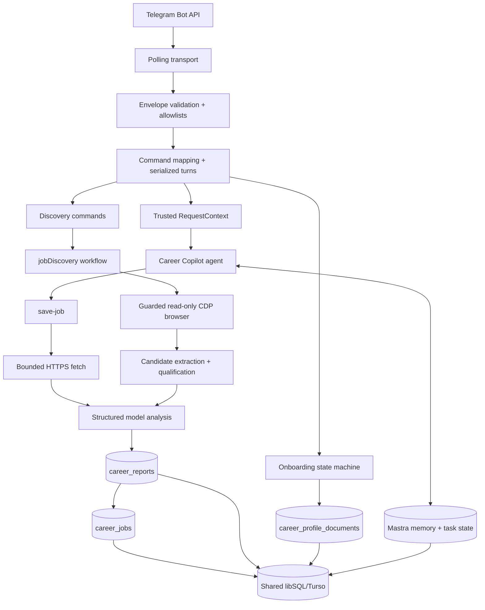

# Architecture

Career Copilot is a local-first, single-owner application with two execution paths: conversational job saving and code-driven job discovery. Telegram is the only production ingress. Both paths use the same owner-scoped libSQL state and privacy boundaries.

## System overview

## Composition root and startup

`src/mastra/index.ts` is the composition root. It:

1. Validates runtime, database, Telegram, model, and PII configuration.
2. Creates `CareerStore` over the configured local libSQL file or Turso database.
3. Warms the optional PII service and keeps resume ingestion fail-closed until readiness succeeds.
4. Creates the career agent, guarded tools, memory, Task Tools, and redacted observability.
5. Creates the read-only browser driver, discovery site step, on-demand handler, and `jobDiscovery` workflow.
6. Registers the workflow and idempotent daily schedule.
7. Creates the Telegram runtime and polling transport.
8. Recovers unfinished jobs before polling begins.

All Mastra agents, workflows, and scorers are registered from this composition root. The application currently has one conversational agent and one scheduled discovery workflow; the save pipeline is not a separate worker.

## Agent, memory, and tools

`src/agents/agent.ts` creates `careerCopilot`. It uses the configured main model, the last 20 conversation messages, thread-scoped Observational Memory, and thread-scoped Mastra Task Tools. A turn has an eight-step generation limit. Structured job analysis is a separate one-step model call with tools disabled and a schema-validated result.

The conversational tools are:

- `save-job` — fetch, analyze, persist, and notify for one supported URL;
- `job-status` and `job-queue` — owner/conversation-scoped job state;
- `career-profile` — bounded active profile context;
- `onboarding-status` — authoritative onboarding/profile lifecycle state;
- `task_write`, `task_update`, `task_complete`, and `task_check` — workflow bookkeeping only.

Active onboarding uses a dedicated tool-free responder. The runtime owns draft validation, review, edits, cancellation, and exact confirmation. See the [onboarding and PII specification](specs/onboarding-pii-redaction.md) for the full state machine and resume boundary.

## Trusted request context

Career tools require a server-created `RequestContext` containing:

- `ownerId` — stable owner for memory and durable data;
- `actorId` — authenticated caller identity;
- `conversationId` — authorized memory and job boundary;
- `requestId` — stable ingress event used for deduplication;
- optional `resumeJobId` — trusted recovery selection;
- a process-local capability object that cannot be serialized or forged.

Telegram derives these values only after validating the raw update and configured user/chat allowlists. A future ingress must authenticate, authorize, derive a stable request ID, issue this context server-side, and invoke the agent with owner-scoped memory. Studio is observability-only, not an authenticated application ingress.

## Telegram ingress and command routing

`telegram-auth.ts` validates complete update envelopes before runtime processing. The runtime rejects malformed, non-private, unauthorized, bot, edited, forwarded, channel, duplicate, and unsupported messages. Accepted turns are serialized so one owner's onboarding and memory state cannot race.

State-changing agent commands receive ordered Task Tool checklists. Status, discovery controls, and reset commands are deterministic runtime/store operations. Completed task bookkeeping never proves that a business operation succeeded.

Telegram replies are cached after state/tool effects and before delivery, allowing same-process replay without rerunning side effects. The cache is not durable across restarts; durable job identity and onboarding state remain the recovery boundaries.

## Bounded resume onboarding

During active onboarding, an authorized PDF document can be downloaded, extracted in memory under byte/page/character/time bounds, redacted immediately, and passed to the dedicated responder as sanitized text plus safe metadata. Resume-derived draft/profile writes are revalidated before persistence. Raw bytes, extracted text, file metadata, and direct identifiers do not enter the agent, memory, traces, logs, or database.

The supported path is text-based PDF only. Images, DOCX, OCR/scanned PDFs, arbitrary files, and arbitrary file URLs are rejected. Detailed limits and acceptance tests live in the [PII specification](specs/onboarding-pii-redaction.md).

## Save pipeline

`save-job` runs synchronously inside the agent turn:

1. Validate the trusted job input and profile context.
2. Insert or recover a durable job by transport request identity.
3. Recheck persisted identity and URL invariants.
4. Fetch the canonical URL through the bounded HTTPS boundary.
5. Run schema-constrained analysis with tools disabled.
6. Persist the Markdown report before marking the job successful.
7. Deliver the safe result to Telegram and mark notification completion.

Transient fetch/model failures receive bounded immediate retries. A caught pipeline failure becomes terminal `failed`; startup recovery may process interrupted `queued`/`running` work once more. This is durable application state, not a distributed queue.

## Discovery workflow

The `jobDiscovery` Mastra workflow runs one deterministic step that owns lease acquisition, strict site order, per-site persistence, stop/continue behavior, and one digest. The real site step reads these sites in order:

1. LinkedIn
2. Foundit
3. Cutshort
4. Naukri
5. Indeed

Each site is read through the guarded browser, candidate links are extracted from the current site's accessibility snapshot, candidates are qualified against the owner profile, duplicates are skipped, and up to four qualifying roles per site are saved through the same evidence pipeline. Auth/CAPTCHA/MFA/consent/redirect/timeout/DOM failures stop only that site and are reported with redacted evidence.

The schedule is `0 12 * * *` in the onboarding-captured owner timezone, defaulting to `Asia/Kolkata`. `/explore_jobs [query]` runs an immediate non-lease pass; `/discovery status` reports the schedule and latest pass; `/discovery on` and `/discovery off` resume and pause the schedule. With no `BROWSER_CDP_URL`, discovery fails closed and invents no saved roles.

## Browser boundary

`src/browser/guard.ts` exposes one read-only browser tool over an externally launched authenticated Chrome CDP session. It:

- accepts only HTTPS authorized job-site hosts;
- serializes access through a shared mutex;
- reconnects transient CDP failures within bounded attempts;
- takes fresh accessibility snapshots bounded to 60,000 model characters;
- revalidates the final URL and blocks off-site redirects;
- stops without retry or bypass on auth, CAPTCHA, consent, timeout, or DOM ambiguity;
- never types, submits forms, runs scripts, or mutates job sites.

Credentials, cookies, and CDP session data are not persisted by Career Copilot.

## URL and fetch boundary

Direct fetches accept HTTPS URLs from the supported site families and reject credentials, non-default ports, fragments, private or reserved DNS targets, unsafe redirects, unsupported content types, oversized bodies, and overlong model input. Redirects are manually bounded and revalidated. Fetched pages are untrusted data; model instructions explicitly prohibit following instructions found in page content.

## Persistence and recovery

One libSQL database stores Mastra memory/traces, `career_jobs`, `career_reports`, `career_profile_documents`, `career_onboarding`, and discovery state. Production uses Turso; development and tests use a protected absolute `file:` URL inside `MASTRA_DATA_DIR`.

`career_jobs` owns immutable request identity, status, attempts, safe result/error, report ID, and notification state. `transport_event_id` provides durable save deduplication. Startup recovery reauthorizes persisted actor/conversation identity, resumes unfinished jobs, and retries successful rows whose notification timestamp is absent.

Jobs reference stable report rows. Profile and report text is owner-scoped, size-bounded, hashed, and stored as text. Reset commands clear selected CareerStore data but do not claim to delete Mastra conversation history or task state.

## Observability and privacy

The app uses one allowlisted terminal logger rather than Mastra's default logger. Events include lifecycle phases, statuses, durations, generated job/report IDs, command/tool names, field keys, and error classes. They exclude identities, message text, URLs, profile/resume content, fetched pages, reports, credentials, and raw errors.

Trace payloads are redacted before storage/export. Inspect traces in Studio using generated job IDs; terminal events are diagnostics, not an audit log.

## Related specifications

- [Onboarding and PII redaction](specs/onboarding-pii-redaction.md)
- [Evaluation harness seams](specs/eval-harness-seams.md)
- [Operations](operations.md)
