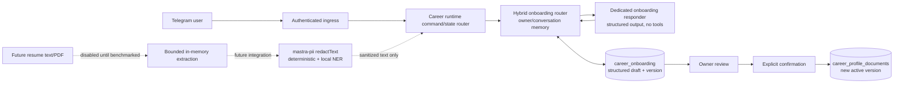
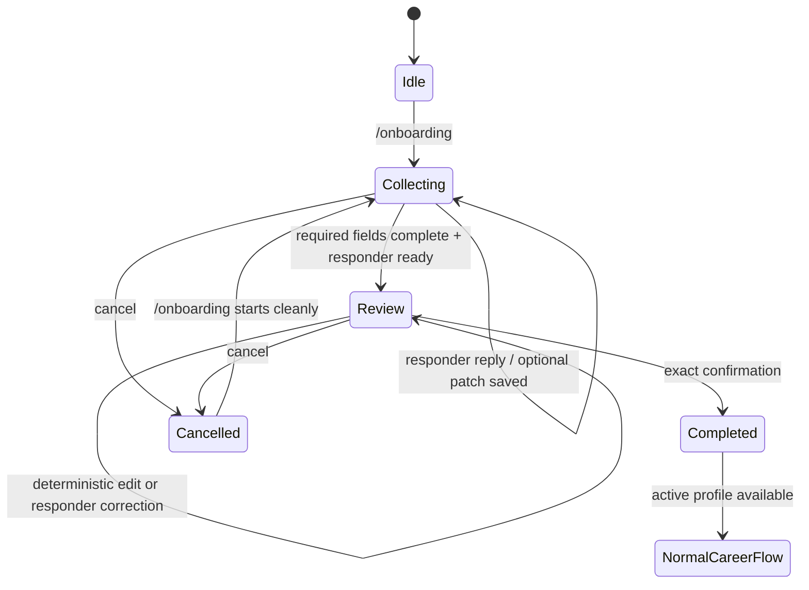

# Onboarding PII Redaction and Layered Mastra Processor

**Status:** Guided onboarding V1 implemented; resume ingestion follows the package benchmark
**Priority:** P0
**Onboarding issue:** [career-copilot #10](https://github.com/KripaMishra/career-copilot/issues/10)
**Package issue:** [mastra-pii #1](https://github.com/KripaMishra/mastra-pii/issues/1)
**Target app branch:** `feat/onboarding-v0`
**Target app worktree:** `/home/kripa/Personal/projects/mastra-demo`
**Package repository:** [KripaMishra/mastra-pii](https://github.com/KripaMishra/mastra-pii)
**Local package checkout:** `/home/kripa/Personal/projects/mastra-pii`
**Provisional npm package:** `@kripamishra/mastra-pii` (confirm npm scope before publishing)

## Objective

Deliver two independently schedulable features:

1. a guided Career Copilot `/onboarding` flow that collects structured career context without resume ingestion and can ship now;
2. a reusable TypeScript package that extends Mastra PII processing with three independently configurable layers, then enables a later resume text/PDF ingestion phase.

The package benchmark is not a blocker for guided onboarding. Plain structured career text, including text headed “Resume,” is accepted after direct-identifier checks. Resume file/upload ingestion remains disabled until the reviewed local deterministic + NER layers can run before document content reaches the ordinary agent, memory, traces, or Turso profile storage.

The three package layers are:

1. **deterministic:** OpenRedaction patterns, context checks, and validators;
2. **NER:** a local ONNX PII token-classification model executed by Transformers.js;
3. **model:** Mastra's existing `PIIDetector` using a caller-supplied Mastra model.

Presidio and Python are not part of this design.

## Why this shape

Mastra already defines the processor lifecycle and provides model-backed PII detection. OpenRedaction supplies the mature TypeScript rule layer. Transformers.js supplies local NER without a service boundary. One package should compose them rather than reimplementing either dependency or creating an agent framework.

The package must work like any Mastra processor:

```ts
import { Agent } from '@mastra/core/agent';
import { createLayeredPii } from '@kripamishra/mastra-pii';

const pii = createLayeredPii({
  strategy: 'redact',
  layers: {
    deterministic: { enabled: true, preset: 'gdpr' },
    ner: {
      enabled: true,
      model: '/models/pii-ner',
      allowRemoteModels: false,
      threshold: 0.8,
    },
    model: {
      enabled: true,
      model: 'provider/model-id',
      threshold: 0.6,
    },
  },
});

export const agent = new Agent({
  id: 'private-agent',
  name: 'Private Agent',
  model: 'provider/model-id',
  inputProcessors: [pii.processor],
});
```

The same package must expose a local pre-agent API:

```ts
const result = await pii.redactText(rawResumeText, {
  layers: ['deterministic', 'ner'],
});
```

Career Copilot uses `redactText()` before calling `agent.generate()`. The model layer is defense-in-depth inside the Mastra processor; raw resumes must never depend on it because the installed Mastra `PIIDetector` allows content through when its internal detection model fails.

## Non-goals

- Reimplementing Mastra `PIIDetector`.
- Reimplementing OpenRedaction patterns.
- Bundling or training a default NER model before benchmarks exist.
- Restoring or rehydrating direct identifiers after redaction.
- Persisting raw resume files, extracted raw text, detection values, or reversible maps.
- Claiming regulatory compliance based on one library or model.
- Supporting OCR, scanned PDFs, DOCX, images, or arbitrary file URLs in V1.
- Applying onboarding redaction indiscriminately to every normal conversation.

## Security invariants

1. Authorization completes before text or files are downloaded, parsed, or inspected.
2. Raw resume bytes and text remain process-memory-only and are discarded after redaction.
3. Raw resume content never reaches the main agent, Mastra memory, working memory, traces, logs, metrics, errors, Turso, or reports.
4. Deterministic and NER layer failures block onboarding ingestion by default.
5. No layer logs or returns original values, OpenRedaction `original`, `redactionMap`, or detection `value` fields.
6. Redaction is irreversible in V1. Use typed placeholders such as `<PERSON_1>`; do not hash direct identifiers.
7. NER model files are pinned by revision and checksum. Production does not download models at request time.
8. PDF parsing is bounded by type, signature, byte size, page count, extracted character count, and timeout.
9. Only confirmed, redacted onboarding context becomes an active profile document.
10. Tests use synthetic canaries only.

## Package architecture

Create a dedicated public repository with this minimal layout:

```text
mastra-pii/
├── src/
│   ├── config.ts
│   ├── deterministic.ts
│   ├── ner.ts
│   ├── merge.ts
│   ├── redact.ts
│   ├── processor.ts
│   └── index.ts
├── test/
│   ├── deterministic.test.ts
│   ├── ner.test.ts
│   ├── merge.test.ts
│   ├── processor.test.ts
│   └── privacy-canary.test.ts
├── fixtures/
│   └── synthetic-resumes.json
├── package.json
├── tsconfig.json
├── README.md
├── LICENSE
└── .github/workflows/release.yml
```

Do not add a workspace, server, CLI, database, telemetry system, plugin registry, or provider abstraction in V1.

### Public API

```ts
import type { PIIDetectorOptions } from '@mastra/core/processors';

type LayerName = 'deterministic' | 'ner' | 'model';

export type PiiEntityType =
  | 'person'
  | 'email'
  | 'phone'
  | 'address'
  | 'date-of-birth'
  | 'government-id'
  | 'financial-id'
  | 'account-id'
  | 'credential'
  | 'ip-address'
  | 'uuid'
  | 'personal-url'
  | 'other';

type ModelLayerOptions = Omit<
  PIIDetectorOptions,
  'strategy' | 'includeDetections' | 'lastMessageOnly'
>;

type LayeredPiiConfig = {
  strategy?: 'redact' | 'block';
  lastMessageOnly?: boolean;
  maxInputChars?: number;
  layers: {
    deterministic?: false | {
      enabled: true;
      preset?: 'gdpr' | 'hipaa' | 'ccpa';
      confidenceThreshold?: number;
      patterns?: string[];
      whitelist?: string[];
    };
    ner?: false | {
      enabled: true;
      model: string;
      revision?: string;
      localModelPath?: string;
      allowRemoteModels?: boolean;
      threshold: number;
      entityMap?: Record<string, PiiEntityType>;
    };
    model?: false | {
      enabled: true;
      options: ModelLayerOptions;
    };
  };
};

type SafeDetection = {
  type: PiiEntityType;
  start: number;
  end: number;
  score: number;
  source: 'deterministic' | 'ner';
};

type SafeRedactionResult = {
  text: string;
  detections: SafeDetection[];
  counts: Partial<Record<PiiEntityType, number>>;
  layersApplied: LayerName[];
};

type LayeredPii = {
  processor: Processor;
  redactText(text: string, options?: { layers?: Array<'deterministic' | 'ner'> }): Promise<SafeRedactionResult>;
  warmup(): Promise<void>;
};

export function createLayeredPii(config: LayeredPiiConfig): LayeredPii;
```

`redactText()` intentionally excludes the Mastra model layer. It is the fail-closed local trust-boundary API. The returned detections contain spans and categories but never matched values or reversible placeholders.

### Deterministic layer

Use `LiteOpenRedaction` from `@openredaction/core/lite` so OpenRedaction's optional NER, audit, learning, metrics, RBAC, and document features are not silently activated.

Required settings:

- cache disabled;
- debug disabled;
- audit disabled;
- placeholder mode;
- bounded `maxInputSize` and `regexTimeout`;
- only explicitly configured categories/patterns;
- no restore API exposed.

OpenRedaction returns `original`, `redactionMap`, and raw detection values. Consume the result inside one function, convert detections immediately to `SafeDetection`, and release every raw field. Never pass the dependency result to logs, traces, callers, snapshots, or thrown errors.

### NER layer

Use `@huggingface/transformers` with a token-classification ONNX model. The implementation must:

- accept a configurable model and revision;
- support a local model directory;
- set `env.allowRemoteModels = false` in production;
- support explicit local WASM paths where required;
- initialize once and share the pipeline;
- provide `warmup()` for startup readiness;
- apply a configurable threshold;
- map BIO/model labels into the package entity taxonomy;
- combine subword tokens and preserve UTF-16 JavaScript string offsets;
- chunk long text with overlap and deduplicate boundary detections;
- throw a safe error on unavailable model, malformed output, or timeout.

Do not select a permanent default model in code until candidates pass the frozen synthetic resume benchmark. Start by benchmarking ONNX token-classification candidates explicitly documented for Transformers.js, including `onnx-community/bert-small-pii-detection-ONNX`. Record model license, revision, model size, labels, precision/recall, cold start, latency, and memory before selection.

### Entity policy

V1 redacts direct identity while preserving career evidence.

Redact by default:

- person names;
- email and phone;
- street/postal addresses;
- exact date of birth and age where identifying;
- government, tax, financial, health, account, and credential identifiers;
- personal usernames and profile URLs;
- IP addresses, UUIDs, secrets, and tokens.

Preserve by default:

- employers and organizations;
- role titles;
- skills and technologies;
- industries;
- education qualifications and institutions;
- employment date ranges;
- city/region-level job preferences;
- compensation and work-authorization facts;
- accomplishments and portfolio descriptions without direct identifiers.

Map dependency/model labels into `PiiEntityType` before applying policy. Organization, role, skill, institution, and career-date labels are excluded from the default redaction set even when a model detects them. Unknown labels map to `other` and block processing pending an explicit policy decision; do not silently preserve them. The entity map and preserve policy must be explicit and tested.

### Merge and redaction

Run deterministic and NER detection against the same original text. Normalize both into `SafeDetection`, then:

1. reject invalid or out-of-bounds spans;
2. sort by start, longer span, source priority, then score;
3. resolve overlaps deterministically, preferring validated deterministic findings for structured identifiers and the longer span for contextual entities;
4. apply replacements once from right to left;
5. number placeholders by type in first-occurrence order.

Never sequentially mutate text before all local spans are collected; doing so invalidates offsets.

### Mastra model layer

The package processor applies the local redacted messages first, then delegates to Mastra `PIIDetector` when the model layer is enabled. Accept `ModelLayerOptions` as installed `PIIDetectorOptions` minus `strategy`, `includeDetections`, and `lastMessageOnly`: the wrapper owns strategy/message selection and always forces detection-detail logging off. Delegate without copying Mastra prompts or schemas. Career Copilot must configure placeholder redaction; generic consumers retain Mastra's other redaction methods through `options`.

Document this limitation prominently: the installed Mastra implementation catches detection-model errors and permits content. Therefore:

- model-only configuration is allowed for general consumers but is not approved for Career Copilot resume ingestion;
- Career Copilot requires deterministic and NER layers at the pre-agent boundary;
- model-layer success must not be reported as proof that local layers ran.

### Message transformation

`processor.processInput()` must:

- preserve message IDs, roles, timestamps, metadata, and non-text parts;
- transform text parts only;
- process only the newest checked message when `lastMessageOnly` is true;
- avoid rewriting prior already-sanitized history;
- abort with a generic reason under `strategy: 'block'`;
- never place raw detections in processor state or tracing metadata.

## Package dependencies and publishing

Provisional `package.json` policy:

```json
{
  "name": "@kripamishra/mastra-pii",
  "version": "0.1.0",
  "type": "module",
  "types": "./dist/index.d.ts",
  "exports": {
    ".": {
      "types": "./dist/index.d.ts",
      "import": "./dist/index.js"
    }
  },
  "files": ["dist", "README.md", "LICENSE"],
  "engines": { "node": ">=22" },
  "dependencies": {
    "@huggingface/transformers": "4.2.0",
    "@openredaction/core": "1.1.5"
  },
  "peerDependencies": {
    "@mastra/core": "^1.52.1"
  },
  "publishConfig": {
    "access": "public"
  }
}
```

Publishing requirements:

1. public dedicated GitHub repository;
2. MIT or Apache-2.0 license selected before first publish;
3. ESM build plus declarations; do not bundle `@mastra/core`;
4. npm `files` allowlist containing only `dist`, README, and license;
5. `npm pack --dry-run` and tarball inspection in CI;
6. unit tests on supported Node versions;
7. integration test against the minimum supported Mastra version;
8. dependency review, secret scan, CodeQL, and license inventory;
9. npm trusted publishing through GitHub Actions OIDC;
10. provenance enabled and long-lived npm publish tokens disabled;
11. release only from protected `v*` tags after a human approval environment;
12. SemVer and a documented Mastra compatibility table.

These dependency versions reflect the researched releases and must be re-verified immediately before implementation; upgrades require the same benchmark and privacy gates. Do not bundle an NER model in the npm tarball. Publish a model manifest with pinned Hugging Face repository, revision, file checksums, license, and expected labels. Production deployment fetches and verifies the model during image/build provisioning, not during a user request.

## Career Copilot onboarding architecture





### Command behavior

`/onboarding`, `/onboarding restart`, and `/onboarding cancel` are parsed in `src/services/career-runtime.ts`.

`/onboarding` now:

1. creates or resumes onboarding state for the trusted owner/conversation;
2. blocks URLs, file/upload requests, non-text/overlength input, obvious direct identifiers, and unrelated commands before any model call while accepting plain structured career text;
3. sends active collection turns to a dedicated onboarding responder using one structured-output generation with owner/conversation-scoped memory, no trusted request context, `toolChoice: 'none'`, and `maxSteps: 1`;
4. validates and persists only the responder's schema-valid `draftPatch`, allowing clarification replies with no draft mutation and one answer to populate multiple clearly stated fields;
5. accepts plain structured career text but never requests or accepts URLs, PDFs, images, DOCX, or arbitrary files in the initial guided-onboarding phase;
6. shows a structured review summary when required fields are complete and the responder marks the draft ready, including ready-with-empty-patch turns;
7. keeps review conversational for non-command text by calling the same memory-enabled, tool-free responder, while exact `confirm`, `cancel`, and deterministic `edit <field>: <value>` remain runtime-owned;
8. completes only after runtime-observed exact `confirm` owner confirmation;
9. allows cancellation without activating the draft and clears draft content.

Normal `/save`, `/job`, and `/queue` behavior remains unchanged outside active onboarding; during active onboarding those commands are held until the owner finishes or cancels onboarding.

### Required onboarding information

Collect only information needed for career assistance:

- experience, education, skills, projects, and achievements gathered through guided questions;
- current role/status and years of experience;
- target roles and seniority;
- preferred industries and company characteristics;
- location, remote/hybrid/on-site preference, and relocation constraints;
- work authorization and sponsorship needs;
- employment type and availability;
- compensation expectations when voluntarily provided;
- strengths, growth areas, likes, dislikes, deal-breakers, and career goals;
- one optional example job or description of the desired job.

Do not require legal name, exact birth date, street address, phone, email, government ID, or financial data. A narrow deterministic onboarding guard rejects obvious direct identifier canaries such as email addresses, phone numbers, legal-name phrases, exact birth-date phrases, government/financial ID labels, and credential assignments before model calls and before draft persistence. This is not a general redactor and must not block allowed career facts such as city, school, employer, work authorization country, compensation, or years of experience.

### Durable state

Add an owner/conversation-scoped `career_onboarding` table:

```text
owner_id             TEXT
conversation_id      TEXT
status               collecting | review | completed | cancelled
draft_json            TEXT
version               INTEGER
created_at            INTEGER
updated_at            INTEGER
PRIMARY KEY (owner_id, conversation_id)
```

Requirements:

- optimistic version checks on updates;
- strict schema validation of draft JSON;
- deterministic rejection of obvious direct identifiers in draft values before persistence;
- no raw resume column;
- owner + conversation scoping on every read/write;
- idempotent start/resume and explicit versioned confirmation;
- confirmation transaction writes a new active `career_profile_documents` version and marks onboarding complete;
- cancellation sets status to `cancelled` and atomically replaces `draft_json` with `{}`; retain only non-content timestamps/version so a later `/onboarding` starts cleanly.

Add narrow `CareerStore` methods rather than a generic repository abstraction.

### Dedicated responder

The composition root injects a dedicated responder around the existing agent/model. The runtime supplies only current structured draft JSON, allowed field definitions, missing fields, state, and the current text. The responder schema contains exactly `reply`, `draftPatch`, and `readyForReview`; it has no tools or confirmation, authorization, activation, owner, chat, user, or memory fields.

The runtime owns authorization and activation. Initial guided onboarding persists only strictly validated structured career fields from plain text and does not accept resume files/uploads. Keep `CareerStore.assertSafeTextContent()` as the existing secret boundary. After `mastra-pii` integration, rerun deterministic + NER `redactText()` over every resume-derived draft/profile candidate and require byte-for-byte equality before persistence.

After completion, profile context must be available immediately. Do not depend on the unused startup `profileText` snapshot. The save path reads current owner-scoped profile text at request time.

### Text turns

While onboarding state is `collecting`, route text through the hybrid onboarding state machine and dedicated structured responder instead of normal agent generation. Pass the trusted owner ID as the Mastra memory resource and the scoped conversation ID as the thread so message history, working memory, and Observational Memory remain enabled. While state is `review`, runtime-only exact confirm/cancel/deterministic edit handling applies first; all other review text goes through the same memory-enabled responder for conversational clarification or natural-language corrections while remaining in review. The durable structured onboarding row remains authoritative until confirmation.

After confirmation, write the active profile document and explicitly refresh approved profile context for subsequent normal turns. Accept plain structured career text, but reject resume file/upload and unrelated file input until the PII integration phase. Reject or safely route unrelated commands according to explicit tests.

### Reply-failure idempotency

For accepted Telegram updates, cache the completed outbound response/result in memory after model/state/tool effects complete but before sending the Telegram reply. If Telegram delivery fails and the same update is retried in the same process, resend the cached response without rerunning onboarding model/state changes or normal agent/tool effects. After a successful cached normal reply, still mark any completed job notification. This cache is deliberately process-local; after a process restart, persisted job deduplication still protects save requests, but onboarding reply retries resume from durable onboarding state rather than from a durable response cache.

### Terminal app logs

`npm run dev` must show useful app-wide events directly in the terminal through one shared structured terminal logger created in `src/mastra/index.ts`, not Mastra's default logger. Inject that logger through Telegram transport, runtime, agent/tools, and the save pipeline. Emit one JSON line per event with an allowlisted payload only. Safe fields include event name, phase, status, version, attempt, duration, field keys, update/request ID, generated job/report ID, command/tool name, and error class/name. Never log owner/user/chat IDs, message text, draft/profile values, fetched content, URLs, analysis/report content, credentials, tokens, or raw errors.

Required useful events include runtime/startup, Telegram polling/update/reply, normal agent turns, commands, protected tool invocation, job fetch/analysis/report/completion/failure, recovery/notification, and onboarding model/draft/review/completion. Cap allowed string and array-item values before writing terminal JSON. Do not log empty Telegram polls or intentional stop aborts as failures.

### Deferred resume/PDF ingestion

Resume file/upload and PDF extraction are intentionally unavailable in the initial guided-onboarding release; plain structured career text is accepted. After the package benchmark and reviewed prerelease, the integration phase supports text-based PDFs only:

1. authorize the Telegram update before calling `getFile` or downloading bytes;
2. accept only Telegram documents with PDF MIME type, `.pdf` name, and `%PDF-` signature;
3. cap download size at 5 MiB;
4. parse in memory with a maintained Node library such as `unpdf`, selected and pinned during implementation;
5. cap at 50 pages and 200,000 extracted characters;
6. enforce a 10-second extraction deadline;
7. reject encrypted, malformed, image-only, or empty PDFs with a safe user message;
8. treat `file_name`, `file_id`, and `file_unique_id` as ephemeral transport metadata: use only what validation/download requires, and never persist or inject it;
9. reject captions or pass caption text independently through the same local redactor before agent use;
10. never write the PDF or raw extracted text to disk/Turso;
11. call local `redactText()` immediately, then release raw buffers/references;
12. inject only sanitized text plus safe metadata such as page count into the onboarding turn.

Document that Telegram retains uploaded files outside this application's control. Make Telegram download and PDF extraction injectable boundaries so tests use fixtures and no live network.

## Career Copilot file map

Expected files for later resume/PII integration:

```text
package.json                         consume package prerelease; add PDF parser
.env.example                        local NER model path/revision and limits
src/config/runtime.ts               validate PII readiness and ingestion limits
src/channels/telegram-auth.ts       authorize bounded PDF document envelopes
src/channels/telegram-transport.ts  injectable authenticated file download
src/services/career-runtime.ts      pre-agent resume redaction
src/mastra/index.ts                 register/configure package processor
src/observability.ts                preserve no-input/no-output trace policy
```

Create additional focused files only where they remove real coupling, for example `src/services/onboarding.ts` and `src/integrations/pdf-text.ts`. Do not turn the change into a general workflow framework.

## Implementation sequence

### Track A — Package deterministic + local NER benchmark

- Implement config validation, safe result types, OpenRedaction lite adapter, local NER, span normalization, merge/redaction, and Mastra processor transformation in `KripaMishra/mastra-pii`.
- Build the frozen synthetic resume corpus and benchmark at least two Transformers.js-compatible ONNX PII models.
- Select and pin one model only after per-entity release gates pass.
- Publish a reviewed prerelease with deterministic + NER local layers.

### Track B — Resume ingestion integration

- Consume the reviewed package prerelease in Career Copilot.
- Add bounded resume text/PDF ingestion and ephemeral metadata handling.
- Keep resume ingestion disabled unless both local layers warm successfully and pass readiness checks.
- Revalidate every resume-derived draft/profile candidate before Turso writes.
- Prove raw canaries never enter agent calls, Mastra memory, Turso, traces, logs, or replies.

### Track C — Mastra model layer

- Wrap the installed `PIIDetector` without copying internals.
- Verify independent deterministic-only, NER-only, model-only, and layered configurations.
- Document fail-open behavior of the Mastra model layer.
- Publish `0.1.0` after compatibility and privacy review.

## Worktree handoff

### Package repository

The public repository and local checkout now exist:

```text
GitHub: https://github.com/KripaMishra/mastra-pii
Local:  /home/kripa/Personal/projects/mastra-pii
Issue:  https://github.com/KripaMishra/mastra-pii/issues/1
Base:   main
```

Create a package feature branch/worktree from `main` when package implementation begins. Keep all redaction-engine, model benchmark, and npm release commits in that repository.

## Required tests

### Package

- each layer enabled independently;
- all layer combinations;
- no enabled layers rejected;
- invalid config rejected before processing;
- deterministic email, phone, government ID, financial ID, token, and address canaries;
- NER person/address/date spans, BIO joins, Unicode, multiline, repeated values, and chunk boundaries;
- deterministic/NER overlap resolution;
- placeholder stability within one result and no reversible map;
- maximum size and regex/model timeout;
- local-model-only production mode;
- missing/corrupt model fails closed;
- text-part-only Mastra message transformation;
- message metadata preservation;
- model-layer delegation and documented model failure behavior;
- assertions that logs/errors/results contain none of the synthetic raw canaries.

### Career Copilot guided onboarding

- `/onboarding` parse/routing and start/resume behavior;
- onboarding resumes after restart;
- active onboarding uses the trusted owner resource and scoped conversation thread for Mastra memory;
- plain structured career text is accepted while URLs and document/file inputs are rejected;
- strict structured draft validation and optimistic versions;
- conversational clarification without draft mutation;
- one answer may populate multiple fields;
- corrections update only returned fields;
- prohibited inputs blocked before the onboarding model;
- dedicated responder uses structured output with owner/conversation memory, no request context or tools, and one step;
- review begins only when required fields are complete and the responder marks ready;
- review summary contains useful career evidence and does not request identity fields;
- explicit confirmation required;
- stale version confirmation rejected;
- confirmation atomically activates one profile version and completes state;
- confirmation refreshes approved profile context without restart;
- cancel clears draft content and restart begins cleanly;
- start/resume/confirm idempotency;
- existing `/save`, `/job`, `/queue`, recovery, authorization, and tracker tests unchanged.

### Career Copilot resume integration follow-up

- unauthorized text/PDF rejected before download or parsing;
- every resume input is redacted before the responder spy receives it;
- bounded valid PDF extraction;
- MIME/extension/signature mismatch, oversized, encrypted, malformed, image-only, timeout, and overlong extraction rejection;
- filename, caption, `file_id`, and `file_unique_id` canaries are rejected/redacted and never persisted or injected;
- raw canaries absent from agent calls, memory tables, onboarding rows, profile documents, traces, lifecycle logs, replies, and snapshots;
- resume-derived draft and completion writes rerun local detection and reject any candidate that changes after redaction.

## Quality gates

Do not enable NER in production based only on aggregate F1. Publish a per-entity report for the frozen synthetic resume set, with stricter false-negative gates for direct identifiers, credentials, government IDs, and financial IDs. Record:

- precision, recall, F1, and false-negative rate by entity;
- complete-redaction rate by document;
- preserved-career-evidence checks;
- cold start and warm latency;
- peak RSS and model size;
- 50th/95th percentile latency at representative resume lengths;
- model revision, license, dataset provenance, and known limitations.

Any high-risk canary leak blocks release.

## Acceptance criteria

- [ ] One public npm package exposes one Mastra-compatible layered processor and one local `redactText()` API.
- [ ] Deterministic, NER, and Mastra model layers can each be disabled, enabled alone, or layered.
- [ ] OpenRedaction is used only for deterministic detection; its raw values and reversible map never escape the adapter.
- [ ] Local NER makes no inference API call and makes no runtime model download in production.
- [x] Guided `/onboarding` ships independently with plain structured career text enabled and resume file ingestion disabled.
- [x] Onboarding asks for all required career context, then requires review and runtime-observed explicit confirmation.
- [x] Active onboarding uses durable structured state plus owner/conversation-scoped Mastra memory.
- [x] Only confirmed structured context becomes an active Turso profile document.
- [ ] A later integration enables bounded resume file/PDF ingestion only after deterministic + NER readiness succeeds.
- [ ] Every resume-derived draft/profile write is revalidated by both local layers.
- [ ] Synthetic canary tests prove raw PII never reaches the main agent, memory, traces, logs, Turso, reports, or user replies.
- [ ] Existing Career Copilot behavior and tests remain green.
- [ ] Package prerelease and application integration are reviewed independently before stable release.

## Primary references

- Mastra processors: https://mastra.ai/docs/agents/processors
- Mastra PIIDetector: https://mastra.ai/reference/processors/pii-detector
- OpenRedaction: https://github.com/sam247/openredaction
- Transformers.js Node inference: https://huggingface.co/docs/transformers.js/en/tutorials/node
- Transformers.js local models: https://huggingface.co/docs/transformers.js/en/custom_usage
- npm peer dependencies: https://docs.npmjs.com/cli/v11/configuring-npm/package-json/#peerdependencies
- npm trusted publishing: https://docs.npmjs.com/trusted-publishers
