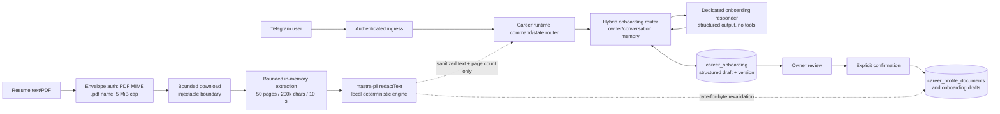
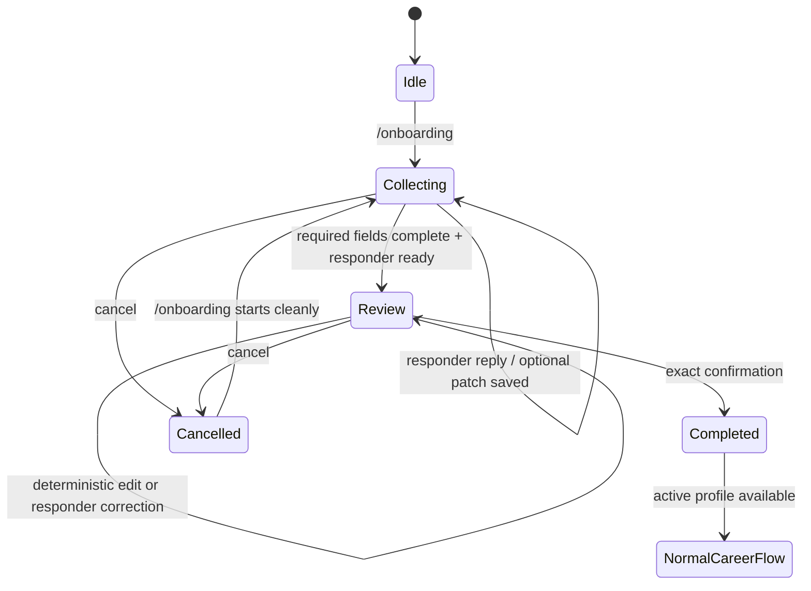

# Onboarding PII Redaction and Layered Mastra Processor

**Status:** Guided onboarding V1 implemented; bounded resume/PDF ingestion integrated (tickets 05–08, [career-copilot #18](https://github.com/KripaMishra/career-copilot/issues/18))
**Priority:** P0
**Onboarding issue:** [career-copilot #10](https://github.com/KripaMishra/career-copilot/issues/10)
**Package issue:** [mastra-pii #1](https://github.com/KripaMishra/mastra-pii/issues/1) (closed; consumed prerelease `@kripamishra/mastra-pii@0.2.0-alpha.5`)
**Target app branch:** `feat/onboarding-v0`
**Target app worktree:** `/home/kripa/Personal/projects/mastra-demo`
**Package repository:** [KripaMishra/mastra-pii](https://github.com/KripaMishra/mastra-pii)
**Local package checkout:** `/home/kripa/Personal/projects/mastra-pii`
**npm package:** `@kripamishra/mastra-pii` (`0.2.0-alpha.5` reviewed and pinned)

## Objective

Deliver two independently schedulable features:

1. a guided Career Copilot `/onboarding` flow that collects structured career context without resume ingestion and can ship now;
2. a reusable TypeScript package that extends Mastra PII processing, then enables a later resume text/PDF ingestion phase.

The package benchmark is not a blocker for guided onboarding. Plain structured career text, including text headed "Resume," is accepted after direct-identifier checks. Resume file/upload ingestion remains disabled until the reviewed local engine can run before document content reaches the ordinary agent, memory, traces, or Turso profile storage.

The shipped package is an adapter with two analyzers behind one interface:

1. **local deterministic engine:** a zero-dependency regex/checksum engine (default — no network, ~2 ms);
2. **remote Presidio adapter:** a deployed Presidio container (spaCy NER + configurable Indian ad_hoc recognizers) that Career Copilot uses only when `PII_PRESIDIO_URL` is configured.

The original layered vision (OpenRedaction lite + Transformers.js ONNX NER + a Mastra model layer) was **not shipped**; those tracks moved to the package repository (see [Historical note](#historical-note)). Presidio is opt-in in Career Copilot: without `PII_PRESIDIO_URL` the runtime keeps zero network egress for user PII.

## Why this shape

Mastra already defines the processor lifecycle. The package composes the local deterministic engine (and optionally a remote Presidio analyzer) behind one interface instead of reimplementing either dependency or creating an agent framework.

The package must work like any Mastra processor:

```ts
import { Agent } from '@mastra/core/agent';
import { createLayeredPii } from '@kripamishra/mastra-pii';

const pii = createLayeredPii({
  patterns: /* custom regex patterns from config */,
  anonymize: { format: 'type' }, // [PAN_1]-style placeholders; no reversible map
  // presidio supplied only when PII_PRESIDIO_URL is configured (NER path);
  // otherwise the local deterministic engine is used (zero network egress)
});

export const agent = new Agent({
  id: 'private-agent',
  name: 'Private Agent',
  model: 'provider/model-id',
  inputProcessors: [pii.processor],  // user input + every prompt
  outputProcessors: [pii.processor], // assistant output
});
```

The same package exposes a local pre-agent API:

```ts
const safe = await pii.redactText(rawResumeText); // → Promise<string>
const safeDocument = await pii.redactDocument(structuredCandidate); // bounded plain JSON
await pii.warmup(); // readiness; no-op for the local engine
```

Career Copilot uses `redactText()` before calling `agent.generate()`. The processor is defense-in-depth inside the Mastra loop; raw resumes must never depend on it. The local engine is regex/checksum-only: emails, PANs, Aadhaars, phones, cards, UPI, IFSC, tokens, and similar structured identifiers are caught, but **names/addresses are NER-only** (Presidio) and obfuscated formats (leet speak, spaced PANs, `[at]` emails) defeat every engine. Resume ingestion therefore redacts what the engine catches; person names/addresses in structured onboarding fields remain owner-confirmed via the existing review flow — no NER-equivalent recall is promised or tested.

## Non-goals

- Reimplementing Mastra `PIIDetector`.
- Reimplementing OpenRedaction patterns.
- Bundling or training a default NER model before benchmarks exist.
- Restoring or rehydrating direct identifiers after redaction.
- Persisting raw resume files, extracted raw text, detection values, or reversible maps.
- Claiming regulatory compliance based on one library or model.
- Supporting OCR, scanned PDFs, DOCX, images, or arbitrary file URLs in V1.
- Applying onboarding redaction indiscriminately to every normal conversation.
- Local NER/model layers or the Mastra model layer: package-repo scope (Track A / Track C).

## Security invariants

1. Authorization completes before text or files are downloaded, parsed, or inspected.
2. Raw resume bytes and text remain process-memory-only and are discarded after redaction.
3. Raw resume content never reaches the main agent, Mastra memory, working memory, traces, logs, metrics, errors, Turso, or reports.
4. Local engine failures block resume ingestion by default (fail-closed; `fallback: 'strict'` semantics on the engine side).
5. No layer logs or returns original values or reversible maps; public output contains only redacted text or the generic `[REDACTION_FAILED]` marker.
6. Redaction is irreversible in V1. Use typed placeholders such as `[PAN_1]`; do not hash direct identifiers.
7. The local engine is regex/checksum-only and requires no model files and no downloads; the remote Presidio adapter (spaCy NER) is used only when `PII_PRESIDIO_URL` is configured.
8. PDF parsing is bounded by type, signature, byte size, page count, extracted character count, and timeout.
9. Only confirmed, redacted onboarding context becomes an active profile document.
10. Tests use synthetic canaries only.

## Package architecture

The published package (`@kripamishra/mastra-pii`) is an adapter with two analyzers behind one interface:

```text
mastra-pii/
├── src/
│   ├── analyzer.ts          # Analyzer interface, local adapter, Presidio adapter, INDIAN_DEFAULTS
│   ├── custom-pattern-worker.js  # terminable worker for bounded custom-regex execution
│   ├── index.ts             # createLayeredPii, redactText/redactDocument/warmup/processor
│   └── ...
├── deploy/                  # Presidio container recipe (opt-in via PII_PRESIDIO_URL)
├── docs/evaluation/         # engine benchmark harnesses and corpora
└── package.json
```

Career Copilot consumes the published package as-is (Track B). No workspace, server, CLI, database, telemetry system, plugin registry, or provider abstraction is added in V1.

### Public API (shipped)

Verified against the published `dist/index.d.ts` of `0.2.0-alpha.5`:

```ts
import type { Processor } from '@mastra/core/processors';

/** Stable entity names emitted by placeholders. */
type PiiEntity =
  | 'address' | 'bank-account' | 'credit-card' | 'custom' | 'date-of-birth'
  | 'email' | 'ip-address' | 'name' | 'passport' | 'phone' | 'ssn' | 'token'
  | 'uuid' | 'medical-id' | 'aadhaar' | 'pan' | 'upi' | 'ifsc' | 'voter-id'
  | 'driving-license' | 'vehicle';

/** Alpha exposes one deterministic local layer; 'ner'/'model' throw LayerUnavailableError. */
type PiiLayer = 'deterministic' | 'ner' | 'model';

type PiiPattern = {
  regex: RegExp;
  entity?: PiiEntity;
  priority?: number;
} & ({ name: string; type?: never } | { type: string; name?: never });

type LayeredPiiConfig = {
  id?: string;
  entities?: readonly PiiEntity[];        // restrict the emitted entity set
  patterns?: readonly PiiPattern[];        // custom deterministic patterns
  customPatterns?: readonly PiiPattern[];  // alias
  layers?: readonly PiiLayer[];            // 'deterministic' only
  analyzer?: Analyzer;                     // custom analyzer (mutually exclusive with presidio)
  presidio?: PresidioAdapterConfig;        // remote Presidio container (opt-in via PII_PRESIDIO_URL)
  fallback?: 'local' | 'strict';           // analyzer outage: degrade to local, or fail closed
  cacheSize?: number;                      // per-text LRU (0 disables; default 256)
  anonymize?: { format?: 'type' | 'uniform'; uniformToken?: string };
};

type PiiProcessor = Processor<string> & Required<Pick<Processor<string>, 'processInput' | 'processLLMRequest' | 'processOutputResult'>>;

type LayeredPii = {
  id: string;
  warmup(): Promise<void>;                                       // readiness; no-op for local
  redactText(text: string, options?: { layers?: readonly PiiLayer[] }): Promise<string>;
  redactDocument(value: unknown): Promise<unknown>;              // bounded plain objects/arrays
  processor: PiiProcessor;                                       // inputProcessors/outputProcessors
};

function createLayeredPii(config?: LayeredPiiConfig): LayeredPii;

class LayerUnavailableError extends TypeError { readonly code: 'PII_LAYER_UNAVAILABLE'; }
```

Notes on the shipped surface:

- `redactText()` returns the redacted **string only** — there is no detections/counts map.
- `redactDocument()` redacts bounded plain objects and arrays (zod-validated JSON is within its contract); it throws on class instances, sparse arrays, and symbol keys.
- `anonymize: { format: 'type' }` emits `[ENTITY_n]` placeholders, numbered in first-occurrence order, stable within one result; `format: 'uniform'` emits a fixed token.
- Requesting `layers: ['ner' | 'model']` throws `LayerUnavailableError` (`PII_LAYER_UNAVAILABLE`) — the package documents this as its behavior for the layers it does not ship.
- Custom patterns have a `name` (or dependency-compatible `type`), `RegExp`, optional `entity`, and optional non-negative `priority`; they run against strings in terminable local workers with time-bounded execution (timeout or worker failure returns `[REDACTION_FAILED]`).
- Fail-closed by default: analyzer outage degrades to the local engine, or to `[REDACTION_FAILED]` under `fallback: 'strict'`. Detector values and raw matches never leave the package.

### Local deterministic engine

The default engine is a pure regex/checksum implementation (~2 ms, no network, zero dependencies):

- built-in Indian recognizers (`INDIAN_DEFAULTS`): Aadhaar + Verhoeff checksum, PAN, UPI, IFSC, voter ID, card, phone, email, IP, bank account, DOB, vehicle, DL, passport, expiry, CVV, secrets;
- custom `patterns` run in bounded worker processes with a 250 ms base + 1 ms/KB budget;
- `entities` can restrict the emitted entity set.

**Limitations (carried into docs):** emails/PANs/passports/Aadhaars/phones/cards/UPI/IFSC/tokens are caught, but **names/addresses are NER-only** (Presidio, opt-in via `PII_PRESIDIO_URL`; with the local engine only they are not caught) and obfuscated formats (leet speak, spaced PANs, `[at]` emails) defeat every engine. Resume ingestion redacts what the analyzer catches; person names/addresses in the resulting draft remain owner-confirmed via the existing structured review flow — no NER-equivalent recall is promised or tested.

### Entity policy

V1 redacts direct identity while preserving career evidence.

Redact by default (engine-detected): email, phone, Aadhaar, PAN, UPI, IFSC, credit/debit cards, bank accounts, passports, driving licenses, vehicle numbers, voter IDs, IP addresses, UUIDs, tokens/secrets, dates of birth.

Preserve by default: employers and organizations, role titles, skills and technologies, industries, education qualifications and institutions, employment date ranges, city/region-level job preferences, compensation and work-authorization facts, accomplishments and portfolio descriptions without direct identifiers. Person names and street/postal addresses are **not** engine-detected (NER-only) and are preserved as-is by the local engine; onboarding keeps them out via the direct-identifier guard and the owner-confirmed review flow.

### Message transformation

`pii.processor` implements `processInput`, `processLLMRequest`, and `processOutputResult`:

- `processInput` redacts the initial Mastra input (messages + untagged system messages) and fails the containing message closed on malformed/unsupported structured data (`[REDACTION_FAILED]`);
- `processLLMRequest` redacts the final model prompt before every LLM call, including tool continuations;
- `processOutputResult` redacts the assistant output message;
- tool arguments/results/errors/raw input/approval/title fields are redacted recursively; provider-generated structural identifiers (tool call ids, tool names, approval ids) are copied verbatim; only in-memory `Uint8Array`/`ArrayBuffer` media is copied as opaque binary data, while string/base64/URL/data-URL textual media is replaced with the fail-closed marker;
- object keys are preserved verbatim; no raw detections ever enter processor state or tracing metadata.

## Package dependencies and publishing

Shipped `package.json` policy (verified from the published tarball):

```json
{
  "name": "@kripamishra/mastra-pii",
  "version": "0.2.0-alpha.5",
  "type": "module",
  "types": "./dist/index.d.ts",
  "exports": {
    ".": {
      "types": "./dist/index.d.ts",
      "import": "./dist/index.js"
    }
  },
  "files": ["dist", "README.md", "LICENSE"],
  "engines": { "node": ">=22.13.0" },
  "dependencies": {},
  "peerDependencies": {
    "@mastra/core": ">=1.57.0 <2"
  },
  "publishConfig": {
    "access": "public"
  }
}
```

Career Copilot pins `@kripamishra/mastra-pii@0.2.0-alpha.5` (exact — npm `latest` is a stale alpha.3) and `@mastra/core@1.59.0` (exact, inside the package's tested matrix).

Publishing requirements:

1. public dedicated GitHub repository;
2. MIT or Apache-2.0 license selected before first publish;
3. ESM build plus declarations; do not bundle `@mastra/core`;
4. npm `files` allowlist containing only `dist`, README, and license;
5. `npm pack --dry-run` and tarball inspection in CI;
6. unit tests on supported Node versions;
7. integration test against the minimum supported Mastra version;
8. dependency review, secret scan, CodeQL, and license inventory;
9. npm trusted publishing through GitHub Actions OIDC;
10. provenance enabled and long-lived npm publish tokens disabled;
11. release only from protected `v*` tags after a human approval environment;
12. SemVer and a documented Mastra compatibility table.

Do not bundle an NER model in the npm tarball; the shipped package ships no model at all. Stable `0.1.0` publishing is Track C (package repository).

## Historical note

The original spec proposed a layered API (`createLayeredPii({ layers: { deterministic, ner, model } })`, OpenRedaction lite adapter, Transformers.js ONNX NER, model manifest, `@openredaction/core`/`@huggingface/transformers` deps). That vision was **not shipped**. The package pivoted to the adapter shape documented above; the deterministic + local NER benchmark track and the Mastra model-layer track moved to the package repository (mastra-pii eval-benchmark #24/#27, Track C). Career Copilot consumes the package as published; the spec sections above describe the shipped surface.

## Career Copilot onboarding architecture





### Command behavior

`/onboarding`, `/onboarding restart`, and `/onboarding cancel` are parsed in `src/services/career-runtime.ts`.

`/onboarding` now:

1. creates or resumes onboarding state for the trusted owner/conversation;
2. blocks URLs, file/upload requests, non-text/overlength input, obvious direct identifiers, and unrelated commands before any model call while accepting plain structured career text;
3. sends active collection turns to a dedicated onboarding responder using one structured-output generation with owner/conversation-scoped memory, no trusted request context, `toolChoice: 'none'`, and `maxSteps: 1`;
4. validates and persists only the responder's schema-valid `draftPatch`, allowing clarification replies with no draft mutation and one answer to populate multiple clearly stated fields;
5. accepts plain structured career text but never requests or accepts URLs, PDFs, images, DOCX, or arbitrary files in the initial guided-onboarding phase;
6. shows a structured review summary when required fields are complete and the responder marks the draft ready, including ready-with-empty-patch turns;
7. keeps review conversational for non-command text by calling the same memory-enabled, tool-free responder, while exact `confirm`, `cancel`, and deterministic `edit <field>: <value>` remain runtime-owned;
8. completes only after runtime-observed exact `confirm` owner confirmation;
9. allows cancellation without activating the draft and clears draft content.

Normal `/save`, `/job`, and `/queue` behavior remains unchanged outside active onboarding; during active onboarding those commands are held until the owner finishes or cancels onboarding.

Recognized Telegram slash commands compile to stable ordered workflow checklists. Agent-driven commands receive the checklist and use Mastra Task Tools (`task_write`, `task_update`, `task_complete`, and `task_check`) in thread-scoped memory. Task completion is bookkeeping and never replaces runtime/store authority. `/onboarding status`, `/reset onboarding`, `/reset profile`, and `/reset all` are deterministic runtime commands: they read or mutate CareerStore state directly and do not invoke the model or Task Tools.

The status/reset commands have these boundaries:

- `/onboarding status` reports collecting, review awaiting exact `confirm`, confirmed-profile active, or no active profile state for the authenticated owner/conversation;
- `/reset onboarding` clears only the current conversation's draft;
- `/reset profile` clears the owner's profile documents and onboarding drafts while preserving jobs/reports;
- `/reset all` transactionally clears the owner's onboarding, profile, jobs, and reports;
- `/onboarding restart` remains draft-only and preserves the active profile and jobs.

An empty `career-profile` result means no active persisted profile was found. It does not identify an authentication, profile-page, or reauthentication problem. There is no durable pending-save state: Task Tool workflow state is not a job record, and an unexecuted URL must not be described as recorded or queued.

### Required onboarding information

Collect only information needed for career assistance:

- experience, education, skills, projects, and achievements gathered through guided questions;
- current role/status and years of experience;
- target roles and seniority;
- preferred industries and company characteristics;
- location, remote/hybrid/on-site preference, and relocation constraints;
- work authorization and sponsorship needs;
- employment type and availability;
- compensation expectations when voluntarily provided;
- strengths, growth areas, likes, dislikes, deal-breakers, and career goals;
- one optional example job or description of the desired job.

Do not require legal name, exact birth date, street address, phone, email, government ID, or financial data. A narrow deterministic onboarding guard rejects obvious direct identifier canaries such as email addresses, phone numbers, legal-name phrases, exact birth-date phrases, government/financial ID labels, and credential assignments before model calls and before draft persistence. This is not a general redactor and must not block allowed career facts such as city, school, employer, work authorization country, compensation, or years of experience.

### Durable state

Add an owner/conversation-scoped `career_onboarding` table:

```text
owner_id             TEXT
conversation_id      TEXT
status               collecting | review | completed | cancelled
draft_json            TEXT
version               INTEGER
created_at            INTEGER
updated_at            INTEGER
PRIMARY KEY (owner_id, conversation_id)
```

Requirements:

- optimistic version checks on updates;
- strict schema validation of draft JSON;
- deterministic rejection of obvious direct identifiers in draft values before persistence;
- no raw resume column;
- owner + conversation scoping on every read/write;
- idempotent start/resume and explicit versioned confirmation;
- confirmation transaction writes a new active `career_profile_documents` version and marks onboarding complete;
- cancellation sets status to `cancelled` and atomically replaces `draft_json` with `{}`; retain only non-content timestamps/version so a later `/onboarding` starts cleanly.

Add narrow `CareerStore` methods rather than a generic repository abstraction.

### Dedicated responder

The composition root injects a dedicated responder around the existing agent/model. The runtime supplies only current structured draft JSON, allowed field definitions, missing fields, state, and the current text. The responder schema contains exactly `reply`, `draftPatch`, and `readyForReview`; it has no tools or confirmation, authorization, activation, owner, chat, user, or memory fields.

The runtime owns authorization and activation. Initial guided onboarding persists only strictly validated structured career fields from plain text and does not accept resume files/uploads. Keep `CareerStore.assertSafeTextContent()` as the existing secret boundary. After `mastra-pii` integration, rerun local-engine `redactText()`/`redactDocument()` over every resume-derived draft/profile candidate and require byte-for-byte equality before persistence.

After completion, profile context must be available immediately. Do not depend on the unused startup `profileText` snapshot. The save path reads current owner-scoped profile text at request time.

### Text turns

While onboarding state is `collecting`, route text through the hybrid onboarding state machine and dedicated structured responder instead of normal agent generation. Pass the trusted owner ID as the Mastra memory resource and the scoped conversation ID as the thread so message history, working memory, and Observational Memory remain enabled. While state is `review`, runtime-only exact confirm/cancel/deterministic edit handling applies first; all other review text goes through the same memory-enabled responder for conversational clarification or natural-language corrections while remaining in review. The durable structured onboarding row remains authoritative until confirmation.

After confirmation, write the active profile document and explicitly refresh approved profile context for subsequent normal turns. Accept plain structured career text, but reject resume file/upload and unrelated file input until the PII integration phase. Reject or safely route unrelated commands according to explicit tests.

### Reply-failure idempotency

For accepted Telegram updates, cache the completed outbound response/result in memory after model/state/tool effects complete but before sending the Telegram reply. If Telegram delivery fails and the same update is retried in the same process, resend the cached response without rerunning onboarding model/state changes or normal agent/tool effects. After a successful cached normal reply, still mark any completed job notification. This cache is deliberately process-local; after a process restart, persisted job deduplication still protects save requests, but onboarding reply retries resume from durable onboarding state rather than from a durable response cache.

### Terminal app logs

`npm run dev` must show useful app-wide events directly in the terminal through one shared structured terminal logger created in `src/mastra/index.ts`, not Mastra's default logger. Inject that logger through Telegram transport, runtime, agent/tools, and the save pipeline. Emit one JSON line per event with an allowlisted payload only. Safe fields include event name, phase, status, version, attempt, duration, field keys, update/request ID, generated job/report ID, command/tool name, and error class/name. Never log owner/user/chat IDs, message text, draft/profile values, fetched content, URLs, analysis/report content, credentials, tokens, or raw errors.

Required useful events include runtime/startup, Telegram polling/update/reply, normal agent turns, commands, protected tool invocation, job fetch/analysis/report/completion/failure, recovery/notification, and onboarding model/draft/review/completion. Cap allowed string and array-item values before writing terminal JSON. Do not log empty Telegram polls or intentional stop aborts as failures.

### Deferred resume/PDF ingestion

Resume file/upload and PDF extraction are intentionally unavailable in the initial guided-onboarding release; plain structured career text is accepted. After the package benchmark and reviewed prerelease, the integration phase supports text-based PDFs only:

1. authorize the Telegram update before calling `getFile` or downloading bytes;
2. accept only Telegram documents with PDF MIME type, `.pdf` name, and `%PDF-` signature;
3. cap download size at 5 MiB;
4. parse in memory with a maintained Node library such as `unpdf`, selected and pinned during implementation;
5. cap at 50 pages and 200,000 extracted characters;
6. enforce a 10-second extraction deadline;
7. reject encrypted, malformed, image-only, or empty PDFs with a safe user message;
8. treat `file_name`, `file_id`, and `file_unique_id` as ephemeral transport metadata: use only what validation/download requires, and never persist or inject it;
9. reject captions or pass caption text independently through the same local redactor before agent use;
10. never write the PDF or raw extracted text to disk/Turso;
11. call local `redactText()` immediately, then release raw buffers/references;
12. inject only sanitized text plus safe metadata such as page count into the onboarding turn.

Document that Telegram retains uploaded files outside this application's control. Make Telegram download and PDF extraction injectable boundaries so tests use fixtures and no live network.

## Career Copilot file map

Files for the resume/PII integration (shipped, tickets 05–08):

```text
package.json                         pins @mastra/core 1.59.0; consumes @kripamishra/mastra-pii 0.2.0-alpha.5 exact; unpdf 1.8.1 exact
.env.example                        PII_* entries (enabled, patterns, limits, readiness); no secrets
src/config/runtime.ts               validates PII readiness and ingestion limits; invalid config fails startup
src/services/pii.ts                 LayeredPii singleton: local engine, warmup, fail-closed redactText/redactDocument
src/services/career-runtime.ts      pre-agent redactText() trust boundary; bounded resume ingestion; readiness gate
src/channels/telegram-auth.ts       authorize bounded PDF document envelopes before getFile
src/channels/telegram-transport.ts  injectable authenticated file download (5 MiB cap); test fake
src/integrations/pdf-text.ts        pinned unpdf parser: 50 pages / 200k chars / 10 s caps; safe rejection paths
src/storage/career-store.ts         resume-derived write revalidation (byte-for-byte equality) via piiRevalidator
src/agents/agent.ts                 processor wired on inputProcessors/outputProcessors (defense-in-depth)
src/mastra/index.ts                 register/configure package processor, PiiService, downloader
src/observability.ts                preserve no-input/no-output trace policy
eval/                               S19 resume scenarios, resume canaries, document plans, memory/trace sinks
```

Create additional focused files only where they remove real coupling, for example `src/services/pii.ts` and `src/integrations/pdf-text.ts`. Do not turn the change into a general workflow framework.

## Implementation sequence

### Track A — Package deterministic + local NER benchmark — PACKAGE-REPO SCOPE (moved)

The deterministic + NER benchmark track moved to the package repository (mastra-pii eval-benchmark #24/#27). The shipped package is the adapter (local deterministic engine + optional remote Presidio) described in [Package architecture](#package-architecture). Local NER/model layers remain package-repo scope.

### Track B — Resume ingestion integration (DONE — tickets 05–08)

- Consume the reviewed package prerelease in Career Copilot. ✔
- Add bounded resume text/PDF ingestion and ephemeral metadata handling. ✔
- Keep resume ingestion disabled unless the local engine warms successfully and passes readiness checks. ✔
- Revalidate every resume-derived draft/profile candidate before Turso writes. ✔
- Prove raw canaries never enter agent calls, Mastra memory, Turso, traces, logs, or replies. ✔

### Track C — Mastra model layer — PACKAGE-REPO SCOPE (not shipped)

The Mastra `PIIDetector` model layer was not shipped. `ner`/`model` layer requests throw `LayerUnavailableError`. Wrapping the installed `PIIDetector`, independent layer configurations, and stable `0.1.0` publishing remain package-repo scope.

## Worktree handoff

### Package repository

The public repository and local checkout now exist:

```text
GitHub: https://github.com/KripaMishra/mastra-pii
Local:  /home/kripa/Personal/projects/mastra-pii
Issue:  https://github.com/KripaMishra/mastra-pii/issues/1
Base:   main
```

Create a package feature branch/worktree from `main` when package implementation begins. Keep all redaction-engine, model benchmark, and npm release commits in that repository.

## Required tests

### Package (package-repo scope)

- invalid config rejected before processing;
- deterministic email, phone, government ID, financial ID, token, Aadhaar, PAN, UPI, IFSC, and card canaries;
- placeholder stability within one result and no reversible map;
- custom-pattern worker bounds (timeout / worker failure → `[REDACTION_FAILED]`);
- maximum size and regex timeout;
- text-part-only Mastra message transformation and metadata preservation;
- fail-closed behavior on analyzer outage (`fallback: 'strict'`) and on `ner`/`model` layer requests (`LayerUnavailableError`);
- assertions that logs/errors/results contain none of the synthetic raw canaries.

NER-specific rows (person/address/date spans, BIO joins, overlap resolution, model-layer delegation) apply to the unshipped NER/model tracks — package-repo scope.

### Career Copilot guided onboarding

- `/onboarding` parse/routing and start/resume behavior;
- onboarding resumes after restart;
- active onboarding uses the trusted owner resource and scoped conversation thread for Mastra memory;
- plain structured career text is accepted while URLs and document/file inputs are rejected;
- strict structured draft validation and optimistic versions;
- conversational clarification without draft mutation;
- one answer may populate multiple fields;
- corrections update only returned fields;
- prohibited inputs blocked before the onboarding model;
- dedicated responder uses structured output with owner/conversation memory, no request context or tools, and one step;
- review begins only when required fields are complete and the responder marks ready;
- review summary contains useful career evidence and does not request identity fields;
- explicit confirmation required;
- stale version confirmation rejected;
- confirmation atomically activates one profile version and completes state;
- confirmation refreshes approved profile context without restart;
- cancel clears draft content and restart begins cleanly;
- start/resume/confirm idempotency;
- existing `/save`, `/job`, `/queue`, recovery, authorization, and tracker tests unchanged.

### Career Copilot resume integration follow-up

- unauthorized text/PDF rejected before download or parsing;
- every resume input is redacted before the responder spy receives it;
- bounded valid PDF extraction;
- MIME/extension/signature mismatch, oversized, encrypted, malformed, image-only, timeout, and overlong extraction rejection;
- filename, caption, `file_id`, and `file_unique_id` canaries are rejected/redacted and never persisted or injected;
- raw canaries absent from agent calls, memory tables, onboarding rows, profile documents, traces, lifecycle logs, replies, and snapshots;
- resume-derived draft and completion writes rerun local detection and reject any candidate that changes after redaction.

## Quality gates

Do not enable NER in production based only on aggregate F1. Publish a per-entity report for the frozen synthetic resume set, with stricter false-negative gates for direct identifiers, credentials, government IDs, and financial IDs. Record:

- precision, recall, F1, and false-negative rate by entity;
- complete-redaction rate by document;
- preserved-career-evidence checks;
- cold start and warm latency;
- peak RSS and model size;
- 50th/95th percentile latency at representative resume lengths;
- model revision, license, dataset provenance, and known limitations.

Any high-risk canary leak blocks release.

## Acceptance criteria

- [x] One public npm package exposes one Mastra-compatible processor and one local `redactText()` API (`createLayeredPii` → `redactText`/`redactDocument`/`warmup`/`processor`; consumed at `0.2.0-alpha.5`).
- [~] Deterministic, NER, and Mastra model layers can each be disabled, enabled alone, or layered. — Shipped package: `deterministic` only; `ner`/`model` requests throw `LayerUnavailableError`. NER/model layering is package-repo scope (Track A/C).
- [x] The local engine never returns or logs raw matches or reversible maps; redaction is irreversible in V1 (typed `[ENTITY_n]` placeholders, no restore API).
- [x] The local engine makes no inference API call and makes no runtime model download; the remote Presidio adapter (the only NER path) is used only when `PII_PRESIDIO_URL` is explicitly configured, and a down analyzer fails closed (readiness never flips).
- [x] Guided `/onboarding` ships independently with plain structured career text enabled and resume file ingestion disabled.
- [x] Onboarding asks for all required career context, then requires review and runtime-observed explicit confirmation.
- [x] Active onboarding uses durable structured state plus owner/conversation-scoped Mastra memory.
- [x] Only confirmed structured context becomes an active Turso profile document.
- [x] Bounded resume file/PDF ingestion is enabled only after local-engine readiness succeeds (config valid + `warmup()`; otherwise fail-closed disabled).
- [x] Every resume-derived draft/profile write is revalidated by the local engine (`redactDocument` for structured candidates, `redactText` for extracted text); candidates that change under redaction are rejected (byte-for-byte equality required).
- [x] Synthetic canary tests prove raw PII never reaches the main agent, memory, traces, logs, Turso, reports, or user replies (S19 eval scenarios + unit suite; zero `redactionHits` across every scanned sink).
- [x] Existing Career Copilot behavior and tests remain green (S01–S18 unchanged; full build/test/eval green).
- [x] Package prerelease and application integration are reviewed independently before stable release. — Release gate of ticket 09; completed by the independent review of the 05–08 changeset (round 1 FAIL → fixes → round 2 PASS).

## Primary references

- Mastra processors: https://mastra.ai/docs/agents/processors
- Package repository: https://github.com/KripaMishra/mastra-pii (Track A/C: local NER benchmark, Presidio adapter, model layer)
- npm peer dependencies: https://docs.npmjs.com/cli/v11/configuring-npm/package-json/#peerdependencies
- npm trusted publishing: https://docs.npmjs.com/trusted-publishers

Historical (unshipped vision, see the historical note): Mastra PIIDetector
(https://mastra.ai/reference/processors/pii-detector), OpenRedaction
(https://github.com/sam247/openredaction), Transformers.js
(https://huggingface.co/docs/transformers.js/en/tutorials/node and
https://huggingface.co/docs/transformers.js/en/custom_usage).
